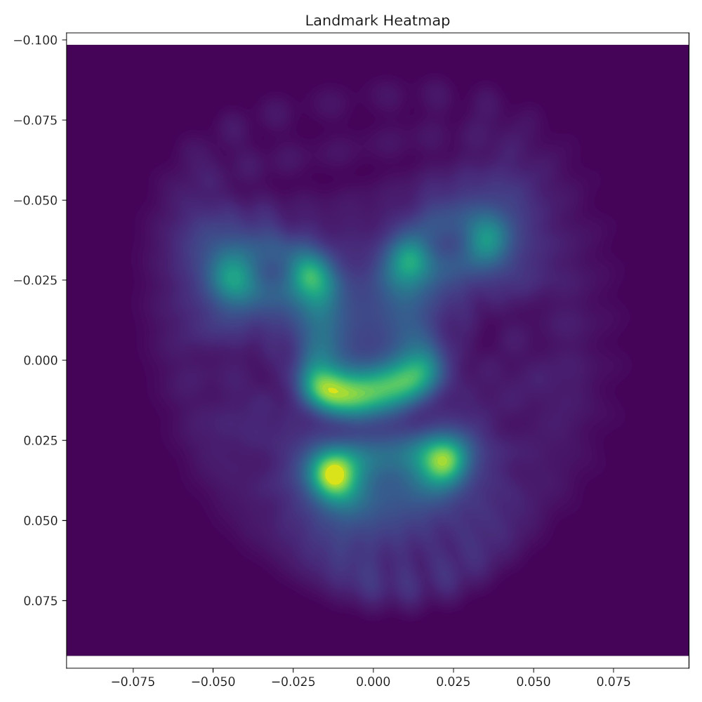

# Utilizarea punctelor de reper faciale pentru gruparea fețelor

Punctele de reper faciale (face landmarks) sunt coordonate cheie pe fața unei persoane, cum ar fi colțurile ochilor, vârful nasului și marginile buzelor, folosite pentru analiză și recunoaștere facială.

Punctele de reper faciale sunt detectate folosind modele de învățare automată antrenate pe imagini etichetate. Aceste modele identifică mai întâi fața într-o imagine, apoi prezic pozițiile exacte ale trăsăturilor importante, cum ar fi ochii, nasul, gura și conturul feței. Algoritmi precum dlib sau rețele neuronale convoluționale (CNN) sunt adesea folosiți pentru această sarcină, oferind coordonate precise chiar și în condiții variate de lumină, expresii sau unghiuri ale feței.

Unul dintre pachetele care ofera detecția acestor puncte de reper este biblioteca MEdiaPipe [Mediapipe URL](https://ai.google.dev/edge/mediapipe/solutions/studio). Aceasta extrage 468 de puncte pentru fiercare față. 

Ne intrebămn dacă aceste puncte caracteristice sunt potrivite pentru a fi utilizate ca embeddings într-o încercare de a construi un model de grupare a fețelor. 

## Algoritm

Aplicam următorul algoritm, cu ajutorul a două funcții, pentru fiecare față din setul de date

### predict(image_path)

- Încarcă o imagine de pe disc.
- O convertește într-o imagine RGB (pentru că MediaPipe necesită imagini RGB).
- Detectează punctele de reper ale feței folosind obiectul face_mesh.
- Convertește punctele de reper într-un array NumPy cu dimensiunea (468, 3).
- Aliniază landmark-urile într-un sistem de coordonate consistent folosind funcția **align_landmarks**.
- Aplatizează acest array 2D într-un vector 1D de lungime 1404 (468 × 3).
- Returnează vectorul.

### align_landmarks(landmarks)

Această funcție:

- Primește un array NumPy cu punctele de reper ale feței feței, având dimensiunea (468, 3).
- Calculează centroidul (media coordonatelor x, y, z ale tuturor punctelor).
- Centrează punctele de reper astfel încât centroidul să ajungă în origine.
- Normalizează punctele prin împărțirea lor la scală (norma L2), pentru a elimina diferențele de mărime a feței sau de rezoluție a imaginii.

În final, avem un vector de 1404 parametrii (toate cele 3 coordonate ale fiecărui punct) pentru fiecare imagine. Acestea pot fi utilizate pentru a testa clusterizarea folosing tSNE sau umap. 

Observăm că nu există clustere în imagini. Punctele de reper extrase de mediapipe nu conțin informație texturală, nu sunt deloc legate de trăsături caracteristice ale feței (alunițe, etc.) nu iau în calcul culoarea părului sau a pielii... etc. În plus, poziția în coordonate a punctelor de reper arată diferențe mici de la o poză la alta pentru că personajele din imaginile noastre vorbesc, au variate expresii faciale... etc. 

