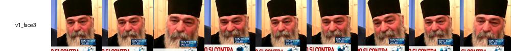

# Pixels as embeddings

## Embedding

Embedding este o reprezentare numerică (un vector de numere reale) care conține esența sau semnificația unui obiect complex — cum ar fi o imagine, un cuvânt, o propoziție sau o față. Este o traducere matematică a acelui obiect într-o formă pe care o rețea neuronală sau alt algoritm o poate înțelege și procesa.

Prelucrarea unui set de obiecte cu ajutorul unui model matematic solicită inventarea unei reprezentări numerice a fiecărui obiect. Aceste reprezentări sunt variate, fiecare clasă de obiecte poate fi reprezentat în foarte multe moduri. Dar, odată ales acest mod, toate obiectele din aceeași clasă vor fi reprezentate în același mod. 

În cazul imaginilor, putem imagina foarte multe moduri de reprezentare. De exemplu, modelul MNIST stocheaza pur si simplu intensitatea fiecărui pixel din imaginea grayscale a imaginilor care au dimensiuni fixe (28 x 28). Aceasta înseamnă că fiecare imagine este reprezentată de un vector de 784 de numere întregi între 0 și 255. De regulă aceste valori sunt normalizate ceea ce produce un vector de 784 de numere aflate între 0 și 1. Acest vector de 784 de numere este un embedding. 

## HSL (Hue, Saturation, Lightness)

Modelul tradițional de a stoca imaginile în culori în sistemele digitale este numit RGB (Red, Green, Blue) - un model în care se stochează pentru fiecare pixel câte o valoare a fiecărei culori elementare: Rosu, Verde, Albastru. Nu este singurul mod de a codifica culoarea unui pixel. In multe situatii este mai util să reprezentăm culoarea fiecărui pixel folosind o combinație de alte trei scări valorice - HSL: 

- Hue (nuanța) este culoarea de bază (de exemplu, roșu, verde, albastru) și este exprimată ca un unghi pe cercul culorilor.
- Saturation (saturația) spune cât de intensă sau cât de „ștersă” este culoarea - unde este poziționată pe intervalul între culoarea pură și negru.
- Lightness (luminozitate) - arată cât de deschisă este culoarea

Modelul HSL permite extragerea canalului de luminozitate care exprimă cel mai bine variabilitatea intensității luminoase. 


[Exemplu de color picker](https://colorizer.org/)

## infer_folder.py

Programul citește un set de imagini, le redimensionează la o valoare fixă, extrage 

```sh
Program that extracts embeddings from a folder of images using the luminance value from each pixel after resizing to a common size. The program also generates t-SNE and UMAP charts of the embeddings.

options:
  -h, --help            show this help message and exit
  -id INPUT_DIRECTORY, --input_directory INPUT_DIRECTORY
                        Directory with the testing images. Can have subdiorectories
  -os OUTPUT_TSNE, --output_tsne OUTPUT_TSNE
                        Name of the t-sne chart. No extension (png will be added, together with the size of the embeddings vector)
  -is IMAGE_SIZE, --image_size IMAGE_SIZE
                        size of the image before pixel extraction
  -ou OUTPUT_UMAP, --output_umap OUTPUT_UMAP
                        Name of the umap chart. No extension (png will be added, together with the size of the embeddings vector)

The structure of the directory has to be very precise, it has to have one level of subdirectories and within those subdirectories the images.
The images have to be extracted faces (not casual images)
    \../../DATA/face/clustering/short/
    ├── face1
    ├── face2
    └── face3
```

## Rezultate

Scopul programului este de a vedea cât de eficient poate fi un model de embeddings bazat pe intensitatea pixelilor. 

- imaginile sunt scalate la o dimensiune de 128 x 128
- transformate în modelul de culoare HSL
- se extrage canalul de luminozitate 

```python
original_image = Image.open(image_path).convert("L")  # "L" mode is for grayscale (luminance)
transform = get_transform(size)
transformed_image = transform(original_image)
luminance_vector = transformed_image.flatten().cpu().numpy().tolist()
```

In urma acestei conversii, fiecare imagine este reprezentată de un vector de 128 x 128 = 16384 de valori între 0 (negru) și 1 (alb). 

Intrebarea este dacă putem găsi o reprezentare care să facă imaginile care afișează aceeași față să fie "apropiate" una de cealaltă. Altfel spus, dacă vom considera fiecare vector de 16384 ca un punct într-un spațiu cu 16384 dimensiuni, punctele care reprezintă imagini ale acelorași fețe vor sta aproape unul de celălalt? Vor forma clustere?  

Evident, nu putem vizualiza un spațiu de 16384 de dimensiuni. Exista doua variante: 

Putem utiliza un algoritm de identificare a clusterelor. Acestea sunt algoritmi de învățare nesupravegheațî care determină prezența și uneori numărul clusterelor dintr-un set de date. Cel mai cunoscut algoritm de detecție a clusterelor este k-means - acesta cere specificarea numărului de clustere deci nu este potrivit. Un alt algoritm, DBSCAN, nu necesită specificarea numărului de clustere în prealabil și este capabil să identifice forme arbitrarii de clustere, precum și să separe zgomotul (puncte izolate care nu aparțin niciunui cluster). Algoritmul funcționează prin stabilirea unui punct de pornire și extinderea unui cluster atâta timp cât vecinii acestuia îndeplinesc criteriile de densitate definite de doi parametri esențiali: epsilon (raza de căutare) și minPts (numărul minim de puncte dintr-o vecinătate pentru a fi considerată densă). Această abordare face ca DBSCAN să fie deosebit de eficient în analizarea datelor spațiale sau în probleme în care structura datelor nu este bine definită.  

Putem utiliza un algoritm de reducere a dimensionalității. Reducerea dimensionalității este un proces utilizat în învățarea automată și analiza datelor pentru a diminua numărul de variabile (dimensiuni) dintr-un set de date, păstrând în același timp cât mai mult din informația relevantă. Speranța noastră este că dacă datele noastre se grupează în clustere in spațiul complet dimensional, acestea vor rămâne grupate și în spațiul cu dimensiuni reduse. Există algoritmi de reducere a dimensionalității foarte agresivi cum ar fi tSNE și umap. 

Putem folosi această tehnică pentru a grupa fețele conducând către un algoritm de detecție a fețelor din imagini noi pe baza unui antrenament preexistent? 

### Date de test

Cele mai apropiate date care pot confirma sau informa această ipoteză sunt imaginile din emisiunile TV/podcasturi. Acestea au o serie de avantaje: sunt bine filmate, bine luminate, persoanele din imagini au aceeași vârstă, aceeași pieptănătură, etc. Dacă aceste imagini se poziționează corect în clustere atunci avem o șansă. 

Setul de date conține 19 seturi diferite de imagini. 





Aplicarea algoritmului DBSCAN retunrează 20 de clustere (destul de aproape) ceea ce înseamnă că putem încerca tehnicile de vizualizare. 

### tSNE

Chiar și în aceste condiții, în care imaginile sunt preluate în cele mai bune condiții, clusterele nu sunt suficient de bine separate. Clusterele există însă, imaginile cu același personaj se apropie una de alta. 


### umap

UMAP (Uniform Manifold Approximation and Projection) este o metodă mai rapidă și mai scalabilă decât t-SNE. Se concentrează și pe păstrarea structurii locale, dar poate păstra și unele informații despre structura globală. UMAP este adesea mai eficient pentru seturi de date mari și poate oferi rezultate mai clare atunci când se vizualizează date complexe. 


Umap aplică o metodă de reducere a dimensionalității mai agresivă. Clusterele sunt mai bine separate. În continuare clusterele sunt distribuite pe suprafețe destul de mari, prea mari pentru a fi direct utilizate pentru comparatii bazate pe funcții de distanță. 

Pentru a putea utiliza acest model avem nevoie de un mod de a plasa noile imagini în spațiul imaginilor care au făcu parte din setul de antrenament. Avem nevoie de un mod de a trasa granițe între diferitele spații ocupate de diferite clustere. Putem utiliza Support Vector Machines pentru a încerca trasarea limitelor dintre clustere. 


In final, putem observa că nu putem să avem încredere în utilizarea pixelilor ca embeddings 

- o mare parte din pixelii pe care ii introducem în calcul nu fac parte din fețe
- micile modificări de poziție, de orientare a capului modifică distribuția valorilor

