# Elementary classifier

Elementary classifier este un model cnn care primeste o imagine si detecteaza daca acea imagine conține o față umană. Modelul nu oferă și poziția acelei fețe în imagine (nu conține un element de regresie). 


## Structura modelului

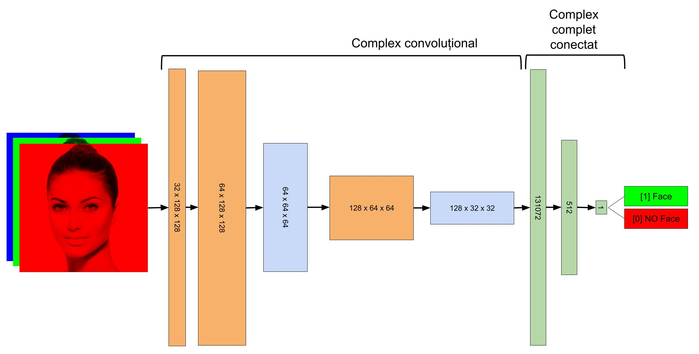


```
==========================================================================================
Layer (type:depth-idx)                   Output Shape              Param #
==========================================================================================
CNNClassifier                            [1, 1]                    --
├─Conv2d: 1-1                            [1, 32, 128, 128]         896
├─Conv2d: 1-2                            [1, 64, 128, 128]         18,496
├─Conv2d: 1-3                            [1, 128, 64, 64]          73,856
├─Linear: 1-4                            [1, 512]                  67,109,376
├─Linear: 1-5                            [1, 1]                    513
==========================================================================================
Total params: 67,203,137
Trainable params: 67,203,137
Non-trainable params: 0
Total mult-adds (Units.MEGABYTES): 687.34
==========================================================================================
Input size (MB): 0.20
Forward/backward pass size (MB): 16.78
Params size (MB): 268.81
Estimated Total Size (MB): 285.79
==========================================================================================
```

## Cum functioneaza modelul

Rețeaua neuronală este compusă din două regiuni diferite: grupul convoluțional și grupul complet conectat. Scopul final al întregii rețele este să producă un număr între 0 (imaginea NU este o față) și 1 (imaginea este o față). Această valoare se obține pe baza unei sume ponderate a valorilor neuronilor din stratul anterior. Valorile din stratul anterior se obțin pe baza unor sume ponderate ale tuturor "neuronilor" din ultimul strat convoluțional iar valorile neuronilor din stratele convoluționale se obțin prin aplicarea unui produs scalar între valorile de unui unei parti din neuronii stratului anterior la care se adauga ponderi, urmată de aplicarea unei funcții de activare. 

Complexul convoluțional este cel care discrimineaza imaginile în funcție de modul de antrenare a rețelei. Componentele acestuia vor fi similare între ele când vor analiza imagini cu fețele și foarte diferite când vor analiza imagini care nu conțin fețe. 

Complexul complet conectat are ca scop sumarizarea informației din complexul convoluțional astfel încât să se păstreze semnificația. 

Penultimul strat din complexul conectat poate avea o cantitate variabilă de neuroni. Valorile acestora sunt foarte apropiate într ele în cazul imaginilor cu fețe și foarte diferite în cazul imaginilor care nu au fețe. Acești vectori reprezintă corect fiecare față și se pot utiliza pentru a reprezenta aceste imagini. Acest gen de vectori se numesc "embeddings". 

Având în vedere că ultimul strat din complexul conectat conține un singur neuron, ne așteptăm ca în cazul detecțiilor pozitive acesta sa fie obținut prin aproximativ aceeași colecție de neuroni "activați" din stratul complet conectat anterior. 

În imaginea următoare,, cu culoarea roșie se vede activarea stratului conectat (cel numit embeddings) în varianta în care acesta are 512. Cu culoarea verde sunt vector în care modelul a detectat corect fețe umane, cu culoarea galbenă este un fals pozitiv (modelul a declarat că imaginea conține o față dar în realitate aceasta conținea o mașină de gătit.) iar cu roșu sunt vectori obținuți în cazul imaginilor care au fost corect etichetate ca neconținând fețe umane. Fiecare dungă verticală din imagine reprezintă o detecție iar fiecare linie orizontală din acestea are intensitatea determinată de valoarea neuronului respectiv (1 pentru cele foarte luminoase, 0 pentru cele complet întunecate).


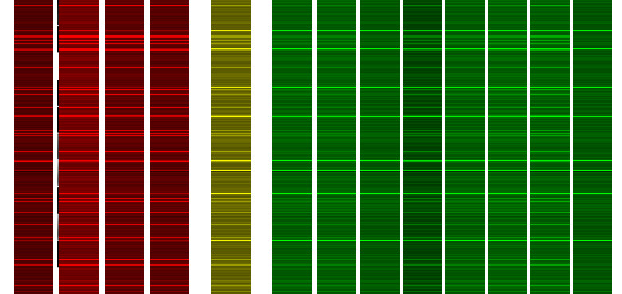

La o analiză atentă se observă similarități semnificative între vectorii corespunzători detecțiilor pozitive. Detecțiile negative (deși la prima vedere destul de similare) sunt în realitate destul de diferite de cele pozitive și destul de diferite între ele. Această situație este mult mai clară dacă reducem semnificativ numărul de neuroni din stratul de embeddings. 

Vectorul final de embeddings poate fi redus semnificativ, caz in care este mult mai evidentă diferența dntre detecțiile negative și cele pozitive. Se observă și în acest caz că detecția fals pozitivă are o distribuție a valorilor asemănătoare detecțiilor pozitive. 

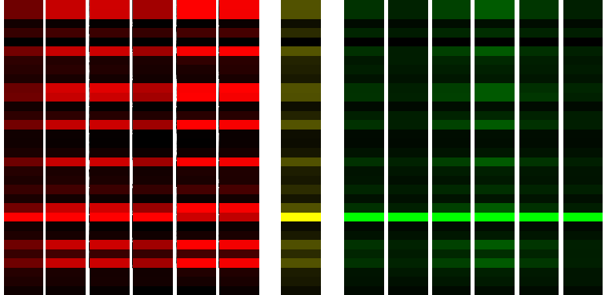

Stratele convoluționale se activează în funcție de imaginea procesată

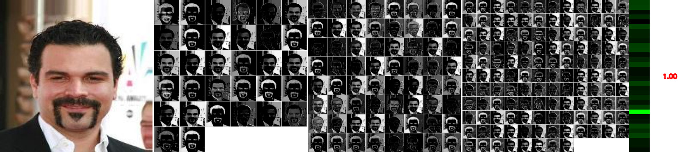

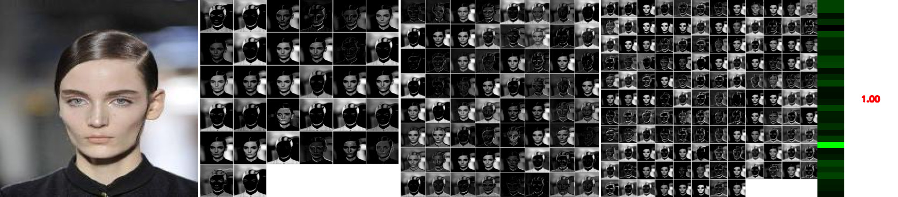

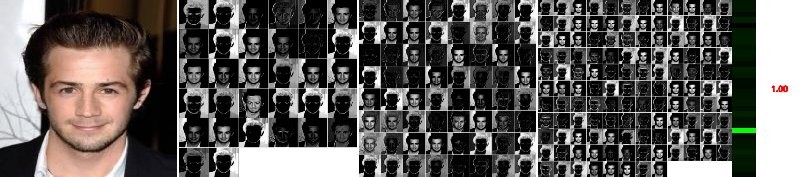

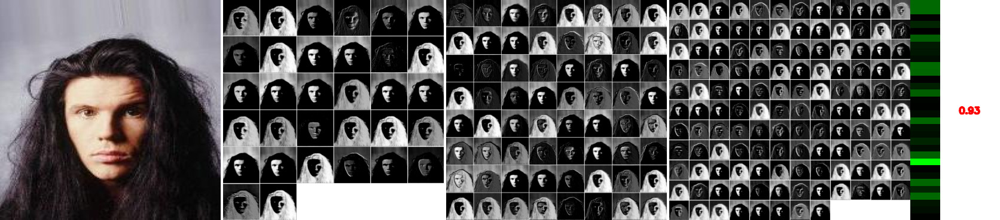

Detecții negative

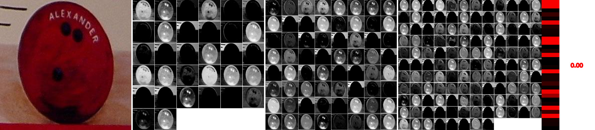

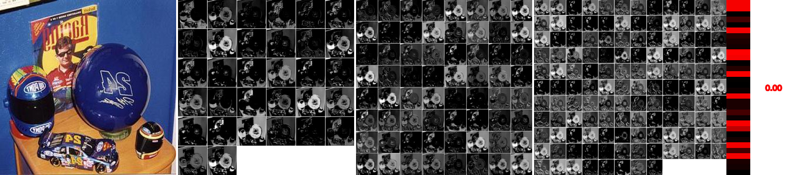

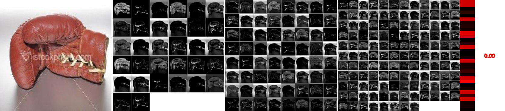

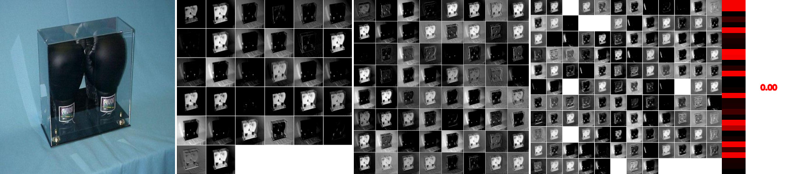

## Training

Procesul de antrenare are nevoie de imagini pozitive si imagini negative. Imaginile pozitive trebuie sa contina toate in numele fisierului o anumita particula (de ex. "face"). Imaginile negative trebuie sa NU contina aceasta particula. 

Antrenarea se face cu ajutorul programului "train.py".  

```bash
usage: python3 train.py -d <data_dir> -m <model_name> -e <embedding_size>

Training program for a simple yes/no CNN classifier

options:
  -h, --help            show this help message and exit
  -e EPOCHS, --epochs EPOCHS
                        Number of epochs
  -d DATA_DIR, --data_dir DATA_DIR
                        The directory containing images
  -p POSITIVE_PREFIX, --positive_prefix POSITIVE_PREFIX
                        the part found in the names of the positive files
  -e EMBEDDING_SIZE, --embedding_size EMBEDDING_SIZE
                        size of the last fully connected layer                        
  -m MODEL, --model MODEL
                        Path to output model
This program trains a simple CNN model using files found in <data_dir> directory. Those images have to be
positive and negative, the positive images having in their names the prefix given in <positive_prefix>
argument
```


Procesul de antrenament face stratele convoluționale sa "învețe" prin creșterea nivelului de activare. Imaginile următoare sunt detectate cu ajutorul unui model în diferite stadii de antrenare. Se observă că structura stratelor convoluționale se modifică, devine din ce în ce mai "precisă", mai "completă" pe măsură ce procesul de antrenament avansează. De asemenea, se observă că stratul de embeddings nu este identic cu cel de la imaginea anterioară, chiar dacă rezultatul detecției este același. 

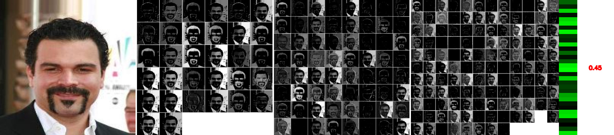

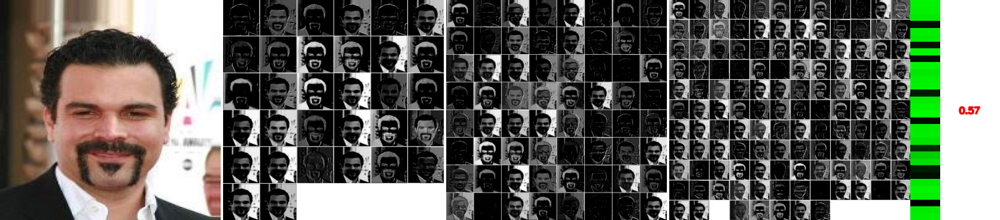

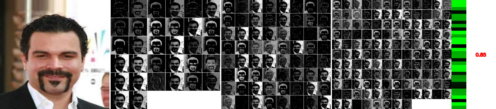

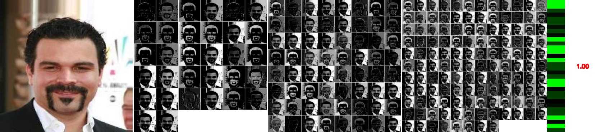


## Inferenta

Inferenta (testul clasificarii) se face cu ajutorul programului infer.py

```bash
usage: infer.py [-h] -i INPUT_IMAGE [-m MODEL]

options:
  -h, --help            show this help message and exit
  -i INPUT_IMAGE, --input_image INPUT_IMAGE
                        Path to input image
  -e EMBEDDING_SIZE, --embedding_size EMBEDDING_SIZE
                        size of the last fully connected layer                        
  -m MODEL, --model MODEL
                        Path to input image


python infer.py -i test_images/face_042220.jpg -m face_large_8.pth -e 8

../../data/classifier/test_images/face_042220.jpgFace detected!: 0.9999973773956299

```

## Inferenta imaginilor dintr-un intreg director

```bash

usage: infer_dir.py [-h] [-m MODEL] [-p POSITIVE_PREFIX] [-df DATA_FOLDER]

Face detection script with drawing and printing options.

options:
  -h, --help            show this help message and exit
  -m MODEL, --model MODEL
                        Path to input image
  -p POSITIVE_PREFIX, --positive_prefix POSITIVE_PREFIX
                        the part found in the names of the positive files
  -df DATA_FOLDER, --data_folder DATA_FOLDER
                        Path to test data


python infer_dir.py -m face_large_8.pth -df test_images/ -e 8
---false positives---
021_0029.jpg: Predicted Probability = 0.9820
---false negatives---

Model Evaluation:
Accuracy: 99.01%
Precision: 0.98
Recall: 1.00
F1 Score: 0.99
```

Problema modelelor de clasificare este că nu pot detecta obiectele căutate decât dacă imaginile analizate conțin fețele încadrate ca în imaginile utilizate la antrenament. De exemplu, reîncadrarea unei imagini o face să se modifice din nedetectată în detectată.

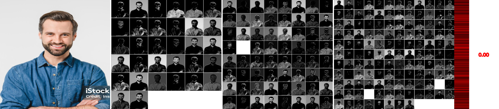

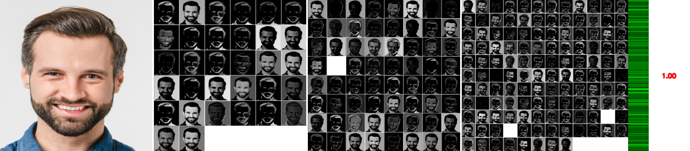

Reîncadrarea imaginii o face din nou să nu mai fie identificată. Utilizând un model antrenat pentru imagini cu încadrare mai strânsă fatza este din nou detectată, cu un scor semnificativ mai mic. 

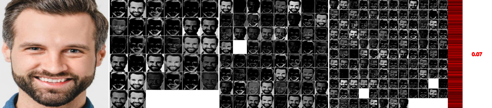

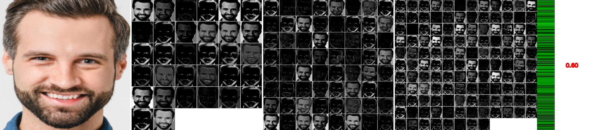

## Detectia cu fereastra mobila

Detectia cu fereastra mobila poate fi folosita ca un substitut de regresie pentru a identifica casetele care contin obiecte (fețe). Aceasta implica baleierea unei imagini cu un patrat de rezolutii variate, extragerea conținutului acestuia și procesarea imaginii rezultate ca o imagine de sine statatoare. Daca fragmentul conține o față, caseta curenta este înregistrată. 

Aceasta metoda este foarte lenta dar poate fi surprinzator de precisa în situația in care casetele de detectie alese se potrivesc cu dimensiunea fețelor din imagine și în condițiile în care se construiește un algoritm NMS care să facă un sumar corect al casetelor la rezoluții foarte diferite. 

De asemenea, clasificatorul trebuie să fie antrenat cu imagini uniforme, de exemplu se pot alege imagini în care fețele umane sunt marcate "larg" - lăsându-se un spațiu în jurul capului sau dimpotrivă foarte "strâns" selectând doar fața lăsând la o parte părul, etc. Teoretic se pot amesteca ambele marcaje dar în majoritatea situațiilor detecțiile provenite de la antrenamentele cu ferestre largi le vor acoperi pe celelalte. 

In timpul detectiei diferitelor casete vor aparea mai multe rezultate pozitive. In jurul fiecărei fețe va exista un numar semnificativ de casete pozitive, în funcție de pasul de mutare a ferestrei si ce del de reducere a rezolutiei. 


Rezultatul procesului 

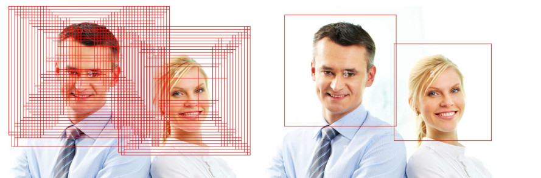

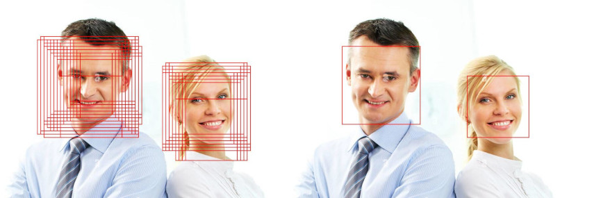


Această soluție (a ferestrei mobile) este utilizată și în modelul Haar cascades. Evoluând dincolo de metoda ferestrei mobile au fost: 

### Selective Search (folosit în R-CNN)

Ca alternativă la sliding window, a fost introdusă metoda Selective Search, care analiza imaginea și realiza o segmentare ierarhică în regiuni similare, generând sute sau mii de propuneri de regiuni (region proposals) care păreau relevante. Aceste regiuni erau apoi trecute printr-un CNN pentru a fi clasificate.

### Fast R-CNN a optimizat procesul

În loc să aplice CNN-ul de fiecare dată pe fiecare regiune, se aplica o singură dată pe întreaga imagine. Se extrăgeau feature maps, iar din ele se obțineau vectori pentru fiecare regiune (prin ROI Pooling). Clasificarea și regresia se făceau într-o singură rețea completă.

### Faster R-CNN (introduce RPN)
Faster R-CNN a fost o revoluție: a introdus RPN (Region Proposal Network), care înlocuia Selective Search cu o rețea neuronală care genera automat regiuni de interes. RPN-ul era complet convoluțional și învăța să propună cutii bounding box relevante. A fost primul sistem end-to-end trainable cu propuneri de regiuni integrate. Totuși, era încă un detector în două etape (two-stage detector): întâi propune regiuni, apoi le clasifică.

Imaginea trece o singură dată printr-un backbone CNN (ex: VGG16 sau ResNet). Rezultatul este o hartă de caracteristici (feature map), care este apoi folosită atât de RPN, cât și de clasificatorul Fast R-CNN. Peste feature map, rulează o fereastră de convoluție 3×3 (sliding window).

La fiecare locație, sunt plasate mai multe ancore (cutii predefinite de diferite dimensiuni și proporții). Pentru fiecare ancoră, rețeaua prezice: Scor de obiect (dacă există un obiect acolo). Corecții pentru coordonatele ancorei (bounding box refinement). După aplicare, se selectează cele mai bune propuneri (~300 per imagine) folosind Non-Max Supression

