# Elementary grid


Instrumentele capabile să clasifice imaginile în funcție de conținutul acestora sunt foarte dependente de încadrarea subiectelor în imagine. Acesteaa nu pot identifica regiunea din imagine în care este prezent obiectul căutat și nu pot identifica mai multe obiecte în aceeași imagine. 

Depășirea acestei limitări pleacă de la observația că rețeaua neuronală poate fi antrenată să clasifice imagini în care obiectul este poziționat în mai multe locuri în imagine și aceasta va clasifica corect imaginea. Întrebarea este dacă nu putem antrena rețeaua astfel încât în loc să clasifice întreaga imagine, să clasifice bucăți din imagine. De exemplu, putem trata fiecare imagine ca fiind compusă din 49 de imagini mai mici aranjate într-o matrice de 7 x 7. 

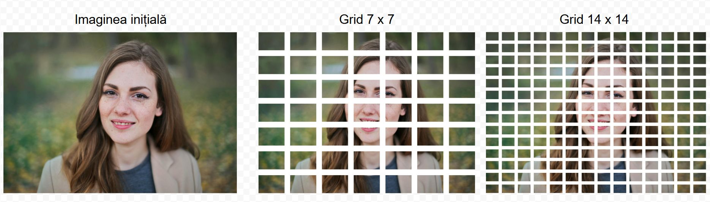

Într-un fel, seamănă cu tehnica ferestrei mobile aplicată la diferite scări. Încă aici, încercăm să introducem acest grid direct în rețeaua neuronală astfel încât aceasta să fie în stare să clasifice fiecare fragment al imaginii ca fiind "fragment de față" sau altceva într-o singură trecere. Pentru aceasta rețeaua trebuie extinsă astfel încât: 

1. complexul convoluțional să fie puțin mai puternic, să fie capabil să observe mai multe detalii la scări mai mici în imagine
2. Stratul complet conectat final (cel care oferă răspunsul), în loc să fie un singur neuron care să conțină probnabilitatea ca întraga imagine să fie pozitivă sau negativă să ofere această probabilitate la nivelul fiecărei celule, adică să fie un strat de n x n valori, unde x este dimensiunea gridului. Fiecare valoare a acestui vector va representa probabilitatea ca celula i,j să conțină un fragment de față umană. 
3. Antrenamentul trebuie să fie special pentru acest tip de detecție. Altfel spus, fiecare imagine introdusă în model ca dată de antrenament trebuie să fie însoțită de o regiune a feței împărțită în n x n celule. 
4. Fiecare valoare a lui n aleasă trebuie să fie antrenată separat, producând un model specific.

Modelul permite identificarea unei singure clase de obiecte. Antrenamentul se face pe baza unui set de imagini pozitive care contin specificatii cu privire la casetele in care se gasesc obiectele (boilding boxes). Celulele din imagini care se gasesc in interiorul unei astfel de casete de detectie sunt considerate obiect si sunt marcate cu valoarea 1. Celulele din afara casetelor sunt marcate cu 0 si reprezinta partea negativa a antrenamentului. 

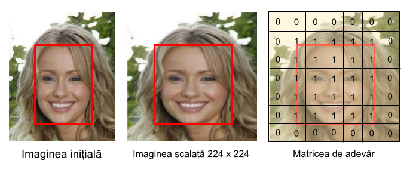

## Modelul

### GridSimpleCNNModel

Modelul este compus dintr-un component convolutional si un clasificator complet conectat. Rezolutia imaginilor de intrare este 224 de pixeli. 

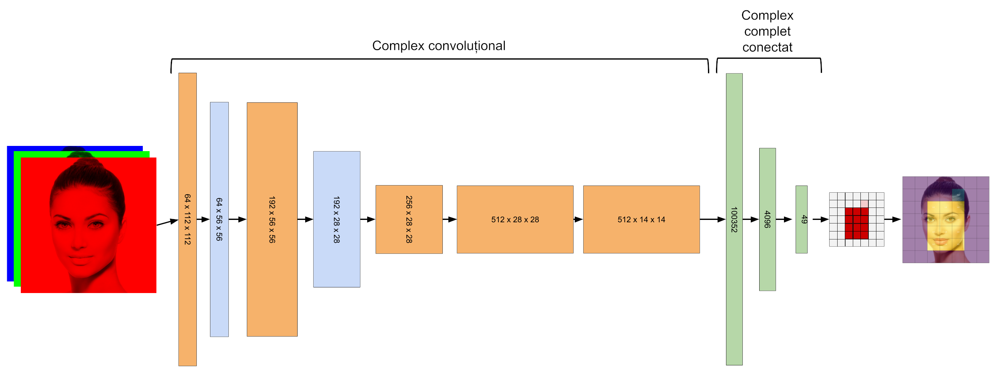

Se observă următoarele: 

Am crescut numărul de strate convoluționale
Am crescut dimensiunea penultimului strat complet conectat de tip "embeddings" la 4096 pentru a oferi o cantitate importantă de ponderi fiecărui neuron din stratul final. 

```
==========================================================================================
Layer (type:depth-idx)                   Output Shape              Param #
==========================================================================================
GridSimpleCNNModel                       [1, 7, 7]                 --
├─Sequential: 1-1                        [1, 512, 14, 14]          --
│    └─Conv2d: 2-1                       [1, 64, 112, 112]         9,472
│    └─LeakyReLU: 2-2                    [1, 64, 112, 112]         --
│    └─MaxPool2d: 2-3                    [1, 64, 56, 56]           --
│    └─Conv2d: 2-4                       [1, 192, 56, 56]          110,784
│    └─LeakyReLU: 2-5                    [1, 192, 56, 56]          --
│    └─MaxPool2d: 2-6                    [1, 192, 28, 28]          --
│    └─Conv2d: 2-7                       [1, 256, 28, 28]          442,624
│    └─LeakyReLU: 2-8                    [1, 256, 28, 28]          --
│    └─Conv2d: 2-9                       [1, 512, 28, 28]          1,180,160
│    └─LeakyReLU: 2-10                   [1, 512, 28, 28]          --
│    └─MaxPool2d: 2-11                   [1, 512, 14, 14]          --
├─Sequential: 1-2                        [1, 49]                   --
│    └─Flatten: 2-12                     [1, 100352]               --
│    └─Linear: 2-13                      [1, 4096]                 411,045,888
│    └─ReLU: 2-14                        [1, 4096]                 --
│    └─Linear: 2-15                      [1, 49]                   200,753
│    └─Sigmoid: 2-16                     [1, 49]                   --
==========================================================================================
Total params: 412,989,681
Trainable params: 412,989,681
Non-trainable params: 0
Total mult-adds (Units.GIGABYTES): 2.15
==========================================================================================
Input size (MB): 0.60
Forward/backward pass size (MB): 16.09
Params size (MB): 1651.96
Estimated Total Size (MB): 1668.65
==========================================================================================
```

## Dimensiunea gridului

Dimensiunea gridului influenteaza calitatea rezultatelor obtinute. 

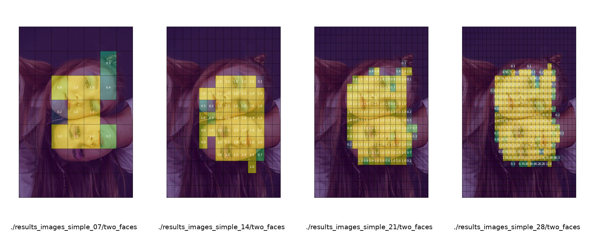


## Training

```bash
usage: train.py -id <image directory> -ld <labels directory> -gs <grid_size> -ep <epochs>

Training program for the grid cnn model

options:
  -h, --help            show this help message and exit
  -id IMAGE_DIRECTORY, --image_directory IMAGE_DIRECTORY
                        The directory with training images
  -ld LABELS_DIRECTORY, --labels_directory LABELS_DIRECTORY
                        The directory with training labels
  -o OUTPUT_NAME, --output_name OUTPUT_NAME
                        Root name of the saved model. If empty, it is auto generated
  -ep EPOCHS, --epochs EPOCHS
                        Number of epochs
  -gs GRID_SIZE, --grid_size GRID_SIZE
                        Grid size
  -bs BATCH_SIZE, --batch_size BATCH_SIZE
                        Batch size
  -ir {224,448}, --input_resolution {224,448}
                        Input resolution for the modl
  -lmo LAMBDA_OBJ, --lambda_obj LAMBDA_OBJ
                        Weight for objectness loss
  -lmn LAMBDA_NOOBJ, --lambda_noobj LAMBDA_NOOBJ
                        Weight for lack of object loss
  -lr LEARNING_RATE, --learning_rate LEARNING_RATE
                        Learning rate for optimizer
  -pbd PRINT_BATCH_LEVEL_SUMMARY, --print_batch_level_summary PRINT_BATCH_LEVEL_SUMMARY
                        Prints a row for each batch
  -dd SUBSET_TRAIN, --subset_train SUBSET_TRAIN
                        Use only a limited number of images for training (usually for testimg models, etc). Leave it at 0 to get all samples)
```

Exemplu de sesiune de antrenament

```
 python train.py -id ../../data/training/large_dataset/images/ -ld ../../data/training/large_dataset/labels/ -pbd True
-dd 100 -bs 20 -ep 5
Training parameters
+------------------+-------------------------------------------+
| Hyperparameter   | Value                                     |
+==================+===========================================+
| Images           | ../../data/training/large_dataset/images/ |
+------------------+-------------------------------------------+
| Labels           | ../../data/training/large_dataset/labels/ |
+------------------+-------------------------------------------+
| Print Batch      | True                                      |
+------------------+-------------------------------------------+
| Subset Train     | YES [100]                                 |
+------------------+-------------------------------------------+
| learning_rate    | 0.0001                                    |
+------------------+-------------------------------------------+
| epochs           | 5                                         |
+------------------+-------------------------------------------+
| batch_size       | 20                                        |
+------------------+-------------------------------------------+
| grid_size        | 14                                        |
+------------------+-------------------------------------------+
| input resolution | 224                                       |
+------------------+-------------------------------------------+
| lambda_obj       | 1.0                                       |
+------------------+-------------------------------------------+
| lambda_noobj     | 0.5                                       |
+------------------+-------------------------------------------+
| device           | cpu                                       |
+------------------+-------------------------------------------+
| model_name_root  | cnn_grid_model_224_14                     |
+------------------+-------------------------------------------+
Starting epoch: 0
    -> Batch number: 1 Batch loss: 1442.0135498046875 Total loss: 1442.0135498046875 total batches: 5
    -> Batch number: 2 Batch loss: 1367.64013671875 Total loss: 2809.6536865234375 total batches: 5
    -> Batch number: 3 Batch loss: 1198.711669921875 Total loss: 4008.3653564453125 total batches: 5
    -> Batch number: 4 Batch loss: 932.5838623046875 Total loss: 4940.94921875 total batches: 5
    -> Batch number: 5 Batch loss: 532.0343017578125 Total loss: 5472.9835205078125 total batches: 5
Epoch [1/5], Loss: 1094.5967041015624
Starting epoch: 1
    -> Batch number: 1 Batch loss: 507.62103271484375 Total loss: 507.62103271484375 total batches: 5
    -> Batch number: 2 Batch loss: 665.302978515625 Total loss: 1172.9240112304688 total batches: 5
    -> Batch number: 3 Batch loss: 1068.2603759765625 Total loss: 2241.1843872070312 total batches: 5
    -> Batch number: 4 Batch loss: 770.397705078125 Total loss: 3011.5820922851562 total batches: 5
    -> Batch number: 5 Batch loss: 903.4708251953125 Total loss: 3915.0529174804688 total batches: 5
Epoch [2/5], Loss: 783.0105834960938
Starting epoch: 2
    -> Batch number: 1 Batch loss: 549.7415771484375 Total loss: 549.7415771484375 total batches: 5
    -> Batch number: 2 Batch loss: 518.2689208984375 Total loss: 1068.010498046875 total batches: 5
    -> Batch number: 3 Batch loss: 823.8250732421875 Total loss: 1891.8355712890625 total batches: 5
    -> Batch number: 4 Batch loss: 700.20703125 Total loss: 2592.0426025390625 total batches: 5
    -> Batch number: 5 Batch loss: 624.728271484375 Total loss: 3216.7708740234375 total batches: 5
Epoch [3/5], Loss: 643.3541748046875
Starting epoch: 3
    -> Batch number: 1 Batch loss: 741.8568115234375 Total loss: 741.8568115234375 total batches: 5
    -> Batch number: 2 Batch loss: 680.9013061523438 Total loss: 1422.7581176757812 total batches: 5
    -> Batch number: 3 Batch loss: 633.6856689453125 Total loss: 2056.4437866210938 total batches: 5
    -> Batch number: 4 Batch loss: 654.5064697265625 Total loss: 2710.9502563476562 total batches: 5
    -> Batch number: 5 Batch loss: 550.8798828125 Total loss: 3261.8301391601562 total batches: 5
Epoch [4/5], Loss: 652.3660278320312
Starting epoch: 4
    -> Batch number: 1 Batch loss: 714.2753295898438 Total loss: 714.2753295898438 total batches: 5
    -> Batch number: 2 Batch loss: 701.8017578125 Total loss: 1416.0770874023438 total batches: 5
    -> Batch number: 3 Batch loss: 657.0728759765625 Total loss: 2073.1499633789062 total batches: 5
    -> Batch number: 4 Batch loss: 371.17547607421875 Total loss: 2444.325439453125 total batches: 5
    -> Batch number: 5 Batch loss: 458.3779296875 Total loss: 2902.703369140625 total batches: 5
Epoch [5/5], Loss: 580.540673828125
```

In timpul rularii antrenamentului, programul va pastra cel mai bun model (cel cu cel mai redus loss) si cele mai recente trei modele (daca se afla la epoca 12, vor fi pastrate 11,10 si 9). Pe parcursul antrenamentului se va inregistra progresul intr-un fisier json: 

```json
{
    "training_parameters": {
        "learning_rate": 0.0001,
        "epochs": 5,
        "batch_size": 20,
        "grid_size": 14,
        "input resolution": 224,
        "lambda_obj": 1.0,
        "lambda_noobj": 0.5,
        "device": "cpu",
        "model_name_root": "cnn_grid_model_224_14"
    },
    "epochs": [
        {
            "epoch": 0,
            "batches": 5,
            "duration": 28.422802686691284,
            "avg_total_loss": 1094.5967041015624
        },
        {
            "epoch": 1,
            "batches": 5,
            "duration": 22.115824460983276,
            "avg_total_loss": 783.0105834960938
        },
        {
            "epoch": 2,
            "batches": 5,
            "duration": 24.5508713722229,
            "avg_total_loss": 643.3541748046875
        },
        {
            "epoch": 3,
            "batches": 5,
            "duration": 25.384461879730225,
            "avg_total_loss": 652.3660278320312
        },
        {
            "epoch": 4,
            "batches": 5,
            "duration": 27.589462280273438,
            "avg_total_loss": 580.540673828125
        }
    ],
    "best_model": {
        "epoch": 4,
        "avg_total_loss": 580.540673828125,
        "model_path": "cnn_grid_model_224_14_4_580.5407.pth"
    }
}
```


## Inference

Exista doua programe pentru detectie, unul pentru o singura imagine si celalalt pentru toate imaginile dintr-un director. Ambele programe produc imagini afiseaza rezultatul detectiei suprapus peste imaginea originala. 

### Detectia unei singure imagini

```bash
python infer.py --help
usage: extract_directory_mtcnn.py -in <input_directory> -ot <output_directory>

Inference program for grid cnn model

options:
  -h, --help            show this help message and exit
  -i IMAGE, --image IMAGE
                        test image path
  -m MODEL, --model MODEL
                        File that holds the model
  -g GRID_SIZE, --grid_size GRID_SIZE
                        Grid size of the model (default 7) - it depends on the model definition

This program gets an image file as argument and runs the prediction model on it. It will detect the "objectness" of a set of cells that are obtained by
splitting the image in a n x n grid. The grid size has to be the same as the grid size with which the model was trained
```

Exemplu

```
python infer.py -i ../../data/test_images/two_faces_separated/two_faces_separated_2.jpg -m ../../TRAINED_MODELS/Elementary_grid/models/224/GridSimpleCNNModel/grid_simple_model_28.pth -g 28
```

va genera in acelasi director ca imaginea originala doua imagini, una care afiseaza suprapunerea rezultatelor fiecarei celule, o a doua care afiseaza practic acelasi lucru sub forma de heatmap. 


Detecția obiectelor însă implică izolarea corectă a acestora. Aceasta înseamnă obținerea unor casete care să conțină fețele identificate. Modelul AI nu permite aceasta, extracția casetelor se poate face în postprocesare. Există mai mulți algoritmi pentru aceasta, în general numiți "Connected Component Labeling". infer.py implementeaza un astfel de algoritm care funcționeaza în esență astfel: 

- modifică matricea astfel încât aceasta să conțină numai valori 0 sau 1
- parcurge matricea rând cu rând până la identificarea primei valori de 1
- înregistrează această celulă într-o listă de celule vizitate
- analizează toți pixelii vecini ai pixelului curent și vede dacă vreunul este 1. Acesta va fi conectat în același obiect. 
- se muta pe unul dintre pixelii cu valoarea 1. 
- înregistreaza acest pixel in lista celulelor vizitate. 
- extinde caseta cu acest pixel. 

in momentul in care se întâlnește un pixel care nu are nici un vecin cu 1 nevizitat regiunea curenta se termina

Programul de inferenta a unei singure imagini face o astfel de analiza si produce o imagine care contine aceste casete suprapuse peste imaginea initiala. In anumite situatii rezultatele sunt satisfacatoare, in alte situatii acestea sunt complet gresite. 

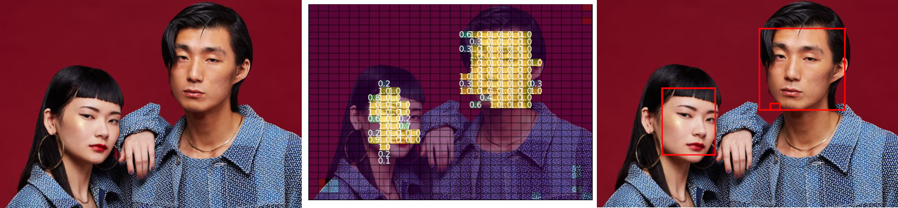


## Detectia unui director intreg

Programul porneste de la un director care are o structura interna de subdirectoare continand imagini de test si genereaza un director similar, cu aceeasi structura a directoarelor dar cu imaginile obtinute in urma procesului de detectie. 

```bash
usage: infer_folder.py -id <input_directory> -od <output_directory> -m <model file>

Inference program for yolo-like regression model that process an entire directory

options:
  -h, --help            show this help message and exit
  -id INPUT_DIRECTORY, --input_directory INPUT_DIRECTORY
                        Directory with the testing images. Can have subdiorectories
  -od OUTPUT_DIRECTORY, --output_directory OUTPUT_DIRECTORY
                        Directory with the inference results. It has to be empty. If the given directory does not exists, it will be created. The structure
                        of the input directory (subdirectories, etc) will be recreated
  -m MODEL, --model MODEL
                        File that holds the model
  -ir {224,448}, --input_resolution {224,448}
                        Input resolution for the modl
  -g GRID_SIZE, --grid_size GRID_SIZE
                        Grid size of the model (default 7) - it depends on the model definition

This program gets a directory with jpeg images as an argument, runs the model on each image replicates the input folder structure on the output folder. The
output folder has to be empty
```

```
python3 infer_folder.py -m models/224/GridSimpleCNNModel/grid_simple_model_28.pth -id /mnt/c/Users/smilutinovici/VisualStudioProjects/UTM/BioMetrics/FaceDetection/data/test_images/ -od /mnt/c/Users/smilutinovici/VisualStudioProjects/UTM/BioMetrics/FaceDetection/Elementary_grid/results_images_simple_28 -g 28 -ir 224
```

## Rezultate

Modalitatea de detectie bazata pe grid este o treapta intermediara intre clasificare si detectie a obiectelor. Rezultatele detectiei bazate pe grid nu pot fi utilizate direct (aceasta nu produce casete cu detectii). Acestea se pot obtine prin analiza ulterioara a matricii de detectie si extragerea casetelor in masura in care celulele sunt conectate. 

Influenta densitatii gridului asupra calitatii detectiei este de cele mai multe ori clara. Sunt situatii in care reteaua mai deasa nu influenteaza foarte mult

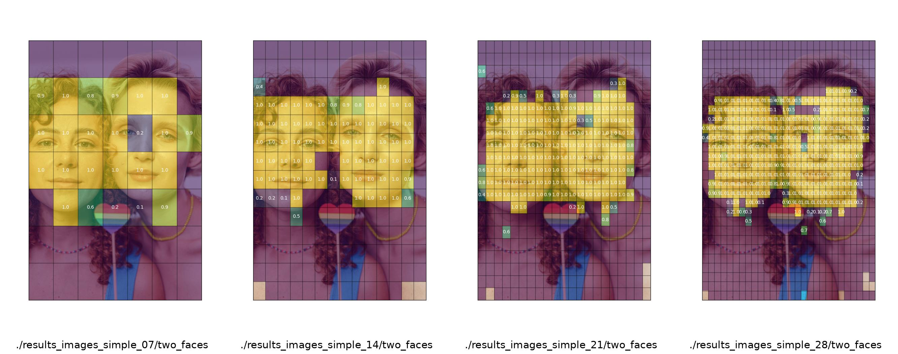


In alte situatii cresterea densitatii retelei conduce la o detectie mult mai buna, acoperind suprafete nedetectate la densitati mai reduse. In special in cazul in care se trece de la 7 la 14

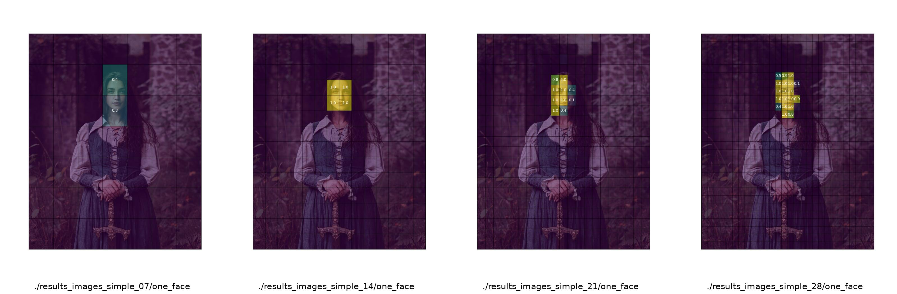

Sunt situatii in care detectia esueaza si structurile vizuale pe care le detecteaza modelul sunt gresite in mod constant, indiferent de densitatea retelei


Sunt situatii in care detectiile la densitati reduse sunt incomplete dat la densitati ridicate sunt complete


Sunt situatii in care la densitati reduse anumite obiecte nu sunt detectate deloc in timp ce la densitati mai ridicate sunt detectate in timp ce alte fete nu sunt detectate indiferent de scara. 

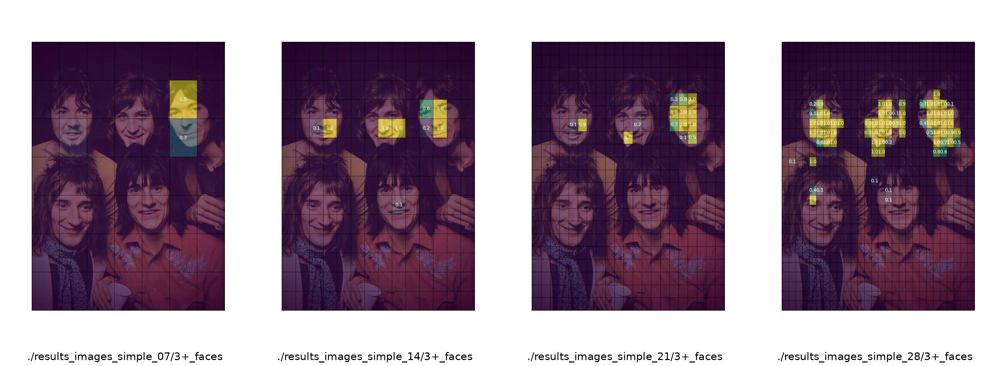

Datorita modului de detectie (in esenta detectia este facuta celula cu celula) doua fete apropiate vor fi detectate ca fiind o singura regiune iar un algoritm de postprocesare le va trata ca pe o singura caseta, adica un singur obiect. 

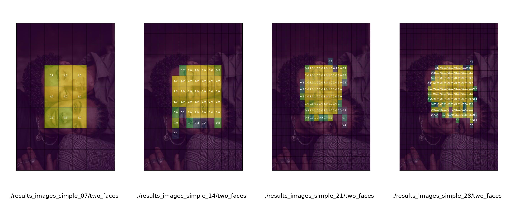

Dupa cum sunt situatii in care falsurile pozitive se accentueaza cu cresterea densitatii retelei. 

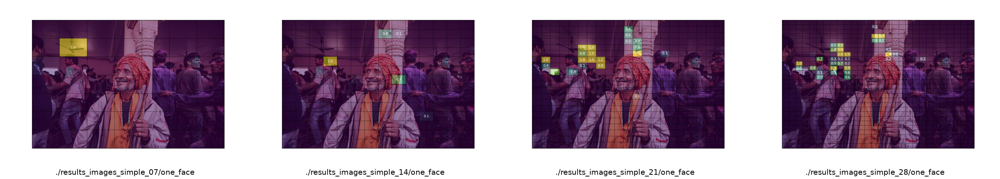

## Adaugarea unui extractor convolutional mai complex

Adaugatea unui extractor convolutional mai complex (cu mai multe straturi/filtre) va imbunatati procesul de recunoastere. 


----
Extractor CNN Simplu

Extractor CNN extins
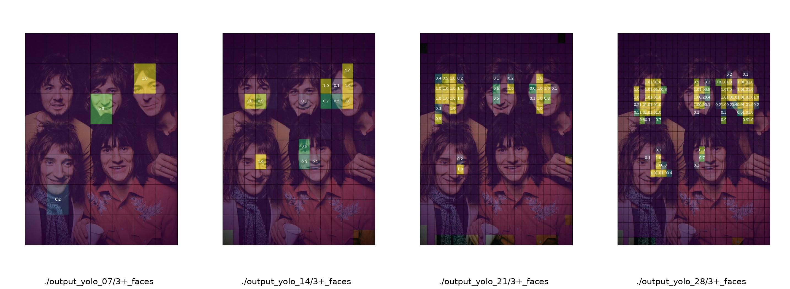

----
Extractor CNN Simplu

Extractor CNN extins
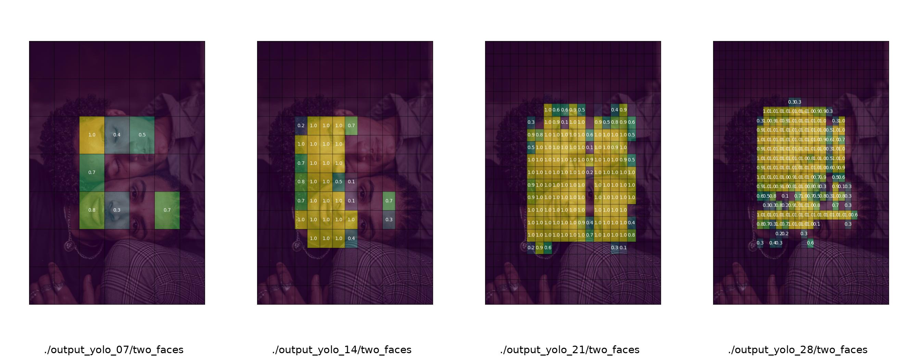


----

Extractor CNN Simplu

Extractor CNN extins
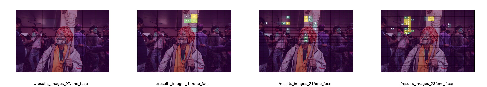
