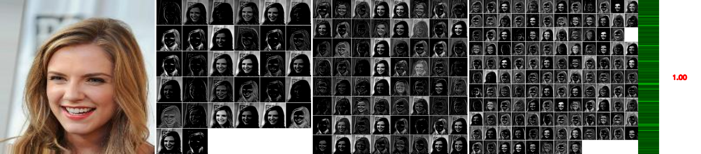
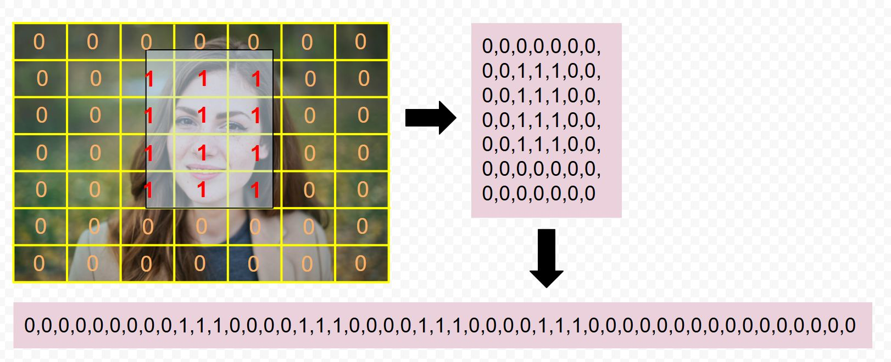
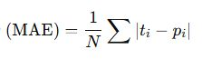
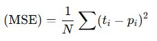
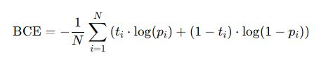
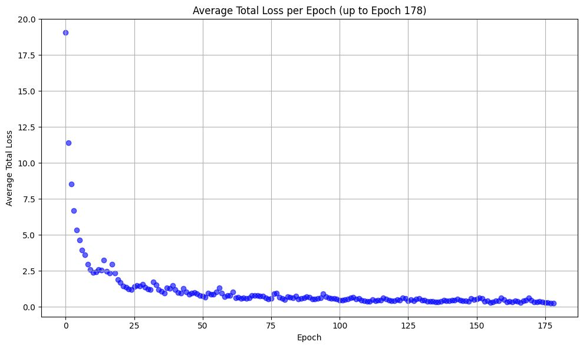

# Detector de obiecte cu regresie 

In modelul cu grila, ne bazam pe faptul că o mică porțiune a unei imagini (o celulă a acelui grid) poate codifica suficientă informație în urma antrenamentului pentru a detecta faptul că aceasta face parte dintr-o față. În esență, detectorul cu grilă este un clasificator cu mai multe clase, câte una pentru fiecare parte a unei fețe (ochi, vârful nasului, etc.). Am văzut care sunt deficiențele acestui model și încercăm să vedem cum putem îmbunătăți acest proces. 

Pentru aceasta, trebuie să observăm că într-o rețea neuronală fiecare neuron (corespunzător de exemplu unei celule în grila modelului cu grile) este "conectat" cu regiuni relativ crescute din imaginea inițială. Suprafața din imaginea inițială care este conectată cu 

Aceasta înseamnă că această celulă va "învăța" din suprafețe extinse ale imaginii. Dacă această celulă este în centrul unei fețe, ea va fi influențată de dimensiunea totală a feței din care face parte. 

## Câmpul receptiv

În imaginea următoare se observă cum, deși stratele convolutionale se reduc în rezoluție, ele conțin informații din întreaga imagine inițială. 



Câmpul receptiv al unui neuron (sau al unei unități) dintr-un anumit strat reprezintă regiunea specifică din spațiul de intrare (cum ar fi imaginea originală sau o hartă de caracteristici dintr-un strat anterior) care influențează valoarea de activare a acelui neuron.

Ne putem imagina că fiecare neuron din rețea are o "fereastră" prin care se uită la stratul anterior. Câmpul receptiv este dimensiunea și localizarea acelei ferestre în acel strat anterior.

În straturile convoluționale, fiecare neuron este conectat doar la o regiune locală a stratului precedent, nu la întreaga hartă de caracteristici. Această regiune locală este câmpul său receptiv.
Creștere în profunzime: Pe măsură ce ne deplasăm prin straturi mai adânci ale rețelei, câmpul receptiv al unui neuron devine progresiv mai mare în raport cu imaginea de intrare originală. Acest lucru se întâmplă deoarece fiecare neuron din stratul curent primește informații de la un câmp receptiv din stratul anterior, care la rândul său a "văzut" o regiune din stratul și mai anterior, și așa mai departe.

Înțelegerea câmpului receptiv este crucială pentru a proiecta arhitecturi eficiente de rețele. Trebuie să ne asigurăm că neuronii din straturile finale au un câmp receptiv suficient de mare pentru a cuprinde informațiile relevante pentru sarcina respectivă (de exemplu, o față întreagă pentru detectarea fețelor).

Factori care influențează dimensiunea câmpului receptiv:
Dimensiunea kernelului (filtrului) convoluțional: Un kernel mai mare mărește direct câmpul receptiv al neuronilor din acel strat.
Pasul (stride) convoluției: Un pas mai mare face ca neuronii din stratul următor să "vadă" regiuni mai îndepărtate în stratul precedent, ducând la o creștere mai rapidă a câmpului receptiv în straturile mai adânci.
Operațiuni de pooling: Straturile de pooling reduc dimensiunea hărților de caracteristici, ceea ce poate influența indirect dimensiunea câmpului receptiv în straturile ulterioare.

Având în vedere toate acestea, putem antrena rețeaua neuronală astfel încât, pentru fiecare celulă din grila să prezică nu doar apartenența acesteia la o anumită categorie dar si dimensiunile casetei care încadrează întreg obiectul (față) din care face parte fragmentul curent. 

Prima model de rețea convoluțională care a propus acest mod de antrenament/inferență a fost YOLO (You only look Once). Modelul implementat aici este o simplificare a YOLO dar direct inspirat din acesta.  

## Functia de cost

Această funcție de cost (YOLOFaceLoss) este concepută pentru a antrena un model de tip YOLO adaptat pentru detectarea fețelor într-o imagine, unde fiecare celulă a unei grile bidimensionale decide dacă există o față și estimează poziția și dimensiunile acesteia. Funcția ia în considerare atât celulele care conțin fețe, cât și cele care nu conțin, aplicând penalizări diferite în funcție de situație.

Funcția de cost trebuie calibrată astfel încât să penalizeze atât o detecție falsă într-o celulă cât și propunerea unui set de coordonate ale casetei feței neconform cu ceea ce conțin datele de antrenament. 



### Moduri de exprimare a erorii de detecție

#### Exemplu de calcul

Presupunem că vectorul care reprezintă adevărul este: 

t = [ 0, 1, 0, 1 ]

iar cel care reprezintă predicțiile este:

p = [ 0.2, 0.4, 0.1, 0.7 ]

Cum am putea exprima diferența dintre cei doi vectori? In primul rând trebuie să observăm că semnul diferenței nu contează ne interesează contrastul dintre detecție și realitate. Putem încerca să utilizăm eroarea medie absolută: 



sau eroarea medie pătratică: 



Ambele aceste calcule însă tratează toate erorile în mod egal ceea ce în clasificare nu este bine. În clasificări ne dorim să maximizăm șansa ca modelul să prezică în mod corect.  

- Dorim să răsplătim predicțiile corecte cu încredere mare
- Dorim să penalizăm sever predicțiile greșite cu încredere mare

BCE (Binary Cross Entropy Loss) are aceste caracteristici:



Observăm că formula conține o sumă de doi termeni. 

Să calculăm fiecare termen: 

| t | p   |  termen 1                |  termen 2                 | valoare finala           |
|---|-----|--------------------------|---------------------------|--------------------------|
| 0 | 0   |   0 * log(0.2) = 0       |  1 * log(0.8) ~= -0.2231  | -(0 + -0.2231) = 0.2231  | 
| 1 | 0.4 | 1 * log(0.4) ~= -0.9163  |  0 * log(0.6) = 0         | -(-0.9163 + 0) = 0.9163  |
| 0 | 0.1 | 0 * log(0.1) = 0         |  1 * log(0.9) ~= -0.1054  | -(0 + -0.1054) = 0.1054  |
| 1 | 0.7 | 1 * log(0.7) ~= -0.3567  |  0 * log(0.3) = 0         | -(-0.3567 + 0) = 0.3567  |

Si acum suma finală: 

BCE = (0.2231 + 0.9163 + 0.1054 + 0.3567) / 4 = 0.4004

Funcția de cost primește ca intrare doi tensori: pred (predicțiile modelului) și target (valorile reale), fiecare de dimensiune (batch, grid_size, grid_size, 5), unde cei cinci coeficienți reprezintă: probabilitatea prezenței unei fețe, coordonatele centrului (x, y) și dimensiunile (lățime, înălțime) ale feței în cadrul celulei.

Se definesc două tipuri de măști:

 - obj_mask identifică celulele unde o față este prezentă (valoarea probabilității reale este mai mare decât zero).
 - no_obj_mask identifică celulele unde nu există față (valoarea probabilității reale este zero).

Pentru celulele care conțin fețe, se calculează:

 - pierdere de coordonate: penalizează diferențele dintre predicțiile și valorile reale pentru x, y, lățime și înălțime, folosind MSE (Mean Squared Error - Eroarea patratica medie), multiplicat cu un factor lambda_coord, ce controlează cât de mult contează acest termen în totalul pierderii.
 - pierdere pentru scorul de încredere (obj_loss): evaluează cât de bine estimează modelul probabilitatea că o față este prezentă într-o celulă. Se folosește Binary Cross Entropy (BCE) între valoarea prezisă și cea reală.

Pentru celulele care nu conțin fețe, se calculează:

pierdere pentru absența obiectului (no_obj_loss): penalizează predicțiile false pozitive (adică atunci când modelul prezice o față acolo unde nu este). Se aplică BCE, ponderat cu un coeficient lambda_noobj, care este în mod normal foarte mic pentru a nu domina pierderea totală.

La final, funcția adună cele trei componente de pierdere și returnează pierderea totală împreună cu fiecare componentă individuală, oferind astfel o imagine detaliată asupra contribuției fiecărui tip de eroare. Este implementat și un mecanism de detectare a valorilor NaN, pentru a identifica eventualele probleme numerice în timpul antrenării.

## Încărcarea datelor

Încărcarea datelor se face cu ajutorul clasei YOLODataset care primește ca argumente directoarele cu imagini și etichete împreună cu funcția de transformare a imaginilor. 

Fișierele cu casetele marcate conțin câte o linie pentru fiecare casetă. Acestea arată astfel: 

```
1 0.10546875 0.7637931034482759 0.072265625 0.06413793103448276
1 0.49755859375 0.07724137931034483 0.0830078125 0.07310344827586207
1 0.8408203125 0.5186206896551724 0.078125 0.0703448275862069
```

Prima coloană este clasa din care face parte obiectul din caseta corespunzătoare (în cazul antrenării detectoarelor de fețe acestea vor fi 1 de fiecare dată) urmat de două coordonate ale centrului casetei si de lățimea și înălțimea acesteia. Cele patru valori sunt subunitare pentru că sunt normalizate la dimensiunea imaginii. 

## Modelul 

```
==========================================================================================
Layer (type:depth-idx)                   Output Shape              Param #
==========================================================================================
YOLOFaceCNN                              [1, 7, 7, 5]              --
├─Sequential: 1-1                        [1, 512, 14, 14]          --
│    └─Conv2d: 2-1                       [1, 64, 112, 112]         9,472
│    └─LeakyReLU: 2-2                    [1, 64, 112, 112]         --
│    └─MaxPool2d: 2-3                    [1, 64, 56, 56]           --
│    └─Conv2d: 2-4                       [1, 192, 56, 56]          110,784
│    └─LeakyReLU: 2-5                    [1, 192, 56, 56]          --
│    └─MaxPool2d: 2-6                    [1, 192, 28, 28]          --
│    └─Conv2d: 2-7                       [1, 128, 28, 28]          24,704
│    └─LeakyReLU: 2-8                    [1, 128, 28, 28]          --
│    └─Conv2d: 2-9                       [1, 256, 28, 28]          295,168
│    └─LeakyReLU: 2-10                   [1, 256, 28, 28]          --
│    └─Conv2d: 2-11                      [1, 256, 28, 28]          65,792
│    └─LeakyReLU: 2-12                   [1, 256, 28, 28]          --
│    └─Conv2d: 2-13                      [1, 512, 28, 28]          1,180,160
│    └─LeakyReLU: 2-14                   [1, 512, 28, 28]          --
│    └─MaxPool2d: 2-15                   [1, 512, 14, 14]          --
├─Sequential: 1-2                        [1, 245]                  --
│    └─Flatten: 2-16                     [1, 100352]               --
│    └─Linear: 2-17                      [1, 4096]                 411,045,888
│    └─BatchNorm1d: 2-18                 [1, 4096]                 8,192
│    └─LeakyReLU: 2-19                   [1, 4096]                 --
│    └─Linear: 2-20                      [1, 245]                  1,003,765
│    └─Sigmoid: 2-21                     [1, 245]                  --
==========================================================================================
Total params: 413,743,925
Trainable params: 413,743,925
Non-trainable params: 0
Total mult-adds (Units.GIGABYTES): 2.11
==========================================================================================
Input size (MB): 0.60
Forward/backward pass size (MB): 18.53
Params size (MB): 1654.98
Estimated Total Size (MB): 1674.11
==========================================================================================
```

### Blocul convoluțional

| Dimensiune ieșire (Output Shape)   |	Descriere strat Conv2d |
|------------------------------------|-------------------------|
|[1, 64, 112, 112]	|  Primul strat convoluțional — extrage caracteristici de bază (muchii, texturi) din imaginea de intrare. Este un strat cu un număr mic de filtre (64) pentru procesare inițială. |
|[1, 192, 56, 56]	|  Extrage caracteristici intermediare. Crește numărul de filtre pentru a învăța reprezentări mai bogate. |
|[1, 128, 28, 28]	|  Reduce temporar numărul de canale pentru diversificare a caracteristicilor. |
|[1, 256, 28, 28]	|  Adaugă profunzime semnificativă în reprezentarea caracteristicilor spațiale. |
|[1, 256, 28, 28]	|  Strat identic consecutiv cu precedentul — permite învățarea unor relații mai complexe între caracteristici fără schimbarea dimensiunii. Această redundanță aparentă este intenționată și inspirată din arhitecturi precum VGG. |
|[1, 512, 28, 28]	|  Mărește semnificativ capacitatea modelului. Este ultimul strat convoluțional înainte de trecerea la dimensiuni spațiale mai mici (prin MaxPool), fiind ideal pentru detecție. |

### Blocul complet conectat

| Dimensiune ieșire (Output Shape)	|  Descriere strat Fully Connected  |
|-----------------------------------|-----------------------------------|
| [1, 100352]  |   Flatten — transformă ieșirea 3D [1, 512, 14, 14] într-un vector unidimensional pentru a putea fi procesat de straturile dense. |
| [1, 4096]	 |  Linear (fully connected) — strat dens cu 4096 neuroni, învață combinații globale ale trăsăturilor extrase anterior. Este un strat foarte mare, cu peste 400 de milioane de parametri. |
| [1, 4096]	 |  BatchNorm1d + LeakyReLU — normalizează activările și introduce non-liniaritate pentru stabilitate și performanță. Dimensiunea nu se schimbă. |
| [1, 245]	  |  Linear final — produce ieșirea finală. În YOLO, această dimensiune este dată de: S × S × (B × 5 + C) (unde S=7, B=1, C=0), deci 7×7×5 = 245 valori. |
| [1, 245]	  |  Sigmoid — asigură că valorile de ieșire sunt în intervalul [0, 1], util pentru interpretarea probabilităților și coordonatelor normalizate. |


## Comentarii

Un model cu un strat dens de 4096 de neuroni și un număr mare de parametri (peste 400 de milioane) are atât avantaje, cât și dezavantaje. Iată o listă cu câteva dintre ele:

### Avantaje:

#### Capacitate mare de învățare a caracteristicilor complexe:

Având atât de mulți parametri și neuroni, acest model poate învăța relații foarte complexe între trăsăturile extrase de la stratul anterior. Acest lucru este util în special pentru sarcini de recunoaștere de imagini, detecție obiecte sau alte probleme complexe, în care datele sunt neclare și conțin multe variabile. In prima versiune YOLO acesta putea detecta 9 clase de obiecte, cu câte două obiecte pentru fiecare celulă. 

#### Performanță ridicată pentru probleme complexe:

Dacă modelul este bine antrenat, cu suficient de multe date și nu există probleme de overfitting, poate obține o performanță excelentă pe sarcini dificile, în care modelele mai simple nu ar avea suficientă putere de procesare pentru a captura toate nuanțele datelor.

#### Flexibilitate în învățarea de combinații nelineare ale trăsăturilor:

Stratului dens îi permite să aplice funcții de activare complexe (precum LeakyReLU sau Sigmoid) care pot învăța relații nelineare între trăsăturile de intrare, ceea ce îl face potrivit pentru sarcini precum clasificarea de imagini, în care relațiile între trăsături nu sunt liniare.

#### Adaptabilitate la diverse tipuri de date:

Poate fi utilizat pentru o gamă largă de aplicații datorită dimensiunii sale mari și abilității de a învăța trăsături extrem de complexe.

### Dezavantaje:

Sensibil la overfitting (suprainvățare):

Unul dintre principalele dezavantaje ale unui model cu un număr mare de parametri este riscul de overfitting. Modelul ar putea învăța foarte bine datele de antrenament, dar să aibă performanțe slabe pe datele de test (date noi).

#### Necesitatea unui număr mare de date pentru antrenare:

Modelul cu o arhitectură atât de complexă are nevoie de o cantitate mare de date pentru a învăța corect. Fără un set de date suficient de mare și diversificat, există riscul de overfitting sau de performanță scăzută.

#### Timp de antrenare mare:

Cu un număr mare de parametri (peste 400 de milioane), antrenarea acestui model va dura mult timp, mai ales dacă datele sunt complexe și modelul necesită multe epoci pentru a converga. Acest lucru necesită resurse computaționale mari și poate duce la costuri mari de antrenare.

#### Cerinte mari de memorie și resurse hardware:

Un astfel de model necesită o cantitate semnificativă de memorie pentru a stoca parametrii și pentru a face calculele necesare în timpul antrenării și predicției. În plus, acest lucru poate duce la o utilizare intensivă a procesorului sau GPU-ului și poate limita utilizarea modelului pe dispozitive cu resurse limitate (ex: dispozitive mobile sau edge devices).

#### Dificultatea în reglarea hiperparametrilor:

Având un număr mare de parametri, reglarea hiperparametrilor (cum ar fi rata de învățare, numărul de neuroni, tipurile de activare, etc.) poate deveni dificilă și consumatoare de timp. Este nevoie de o metodă eficientă de selecție a hiperparametrilor, de obicei folosind tehnici automate (de exemplu, căutare pe grid sau optimizare bayesiană).

## Antrenament

Procesul de antrenament dureaza in jur de 4-5 ore pe o placa Nvidia Titan XP 12G RAM. 

