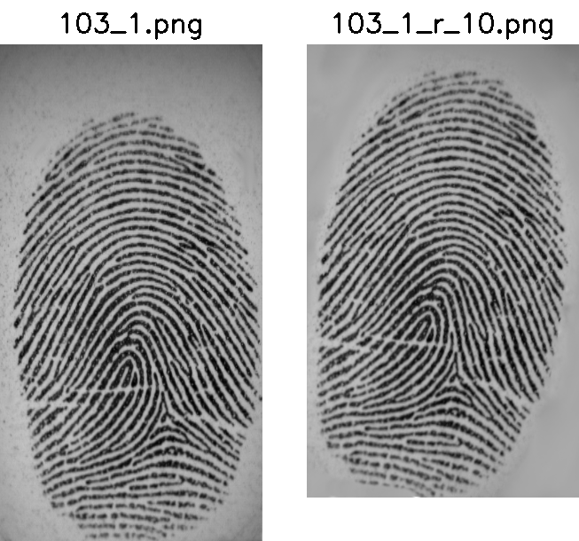
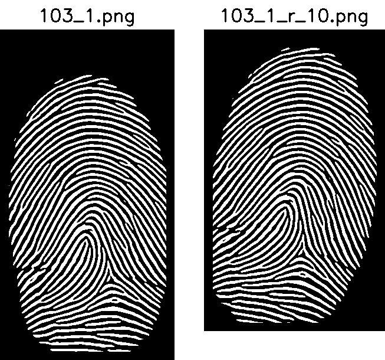
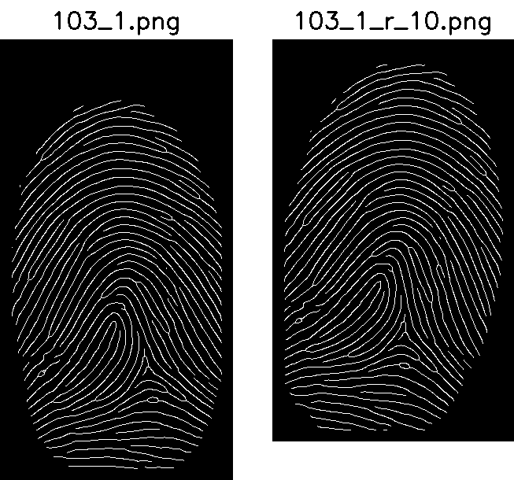
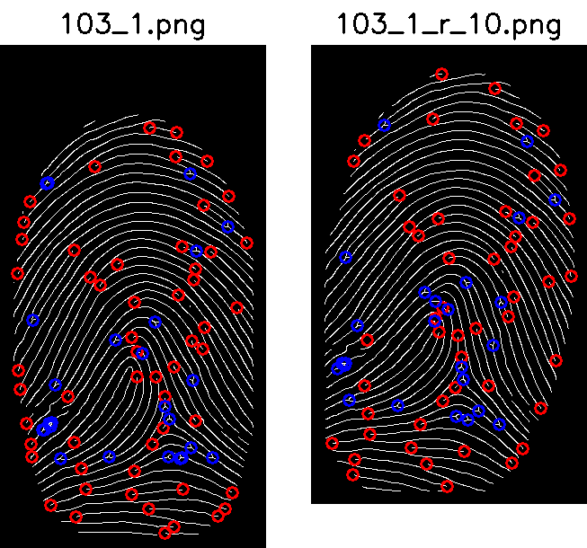
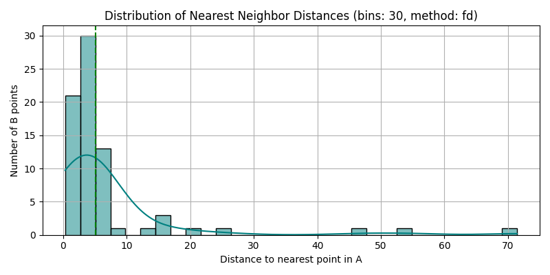

# Extragerea caracteristicilor (minutiae) din imaginile cu amprente digitale. 

Imaginile cu amprente digitale pot fi comparate automat între ele utilizând o serie de micro-structuri care se gasesc în crestele acestora. Micro-structurile căutate sunt de două feluri: final de creastă și bifurcații. Pentru a permite o extragere consistentă si cu cât mai puțin zgomot a acestor micro-structuri este nevoie de o preprocesare aparte a acestor imagini care să evidențieze căt mai bine crestele amprentelor și să estompeze cât mai mult spațiile dintre acestea. Etapele acestei preprocesări sunt de obicei următoarele: 

- Segmentare - izolarea imaginii amprentei de pixelii de fundal
- Evidențierea crestelor, proces care are mai multe subetape: 
  - Estimarea orientării locale - unde se pot estima unghiurile pe care fiecare creastă le are cu marginea imaginii
  - Estimarea frecvenței crestelor
  - Pe baza orientării și frecvențelor crestelor se pot crea o serie de filtre locale orientate, numite filtre de tip Gabor. Acestea se aplică asupra imaginii si conduc la o creștere a clarității și contrastul imaginii. 
- Obținerea imaginii scheletice - o tehnică de prelucrare a imaginii care produce o imagine complementară în care fiecare creastă este reprezentată printr-un singur pixel. 

După preprocesare se extrag aceste micro-structuri caracteristice, care sunt reprezentate de coordonatele punctului central, împreună cu unghiurile structurilor (unul singur pentru finalul crestelor și trei pentru bifurcații).
 
Poziția (și ocazional unghiurile) reprezintă împreună un set de date care pot fi comparate cu seturi similar extrase dintr-o bază de date conducând la identificarea amprentei sau cel puțin la restrângerea semnificativă a candidaților. 

Comparația între două seturi de puncte ridică propriile probleme - nu există nici o garanție că cele două seturi, chiar dacă provin din amprente ale aceleiași persoane, vor acea aceeași rotație, aceeași listă de puncte, etc. Comparația se poate face în mai multe feluri, fie pe baza metodelor statistice (rețele neuronale) fie prin scalare/rotire până lka minimizarea unei funcții de distanță între cele două seturi. 

# Crearea bazei de date

Programul de creare a bazei de date scanează un director cu amprente digitale și contruiește un fișier text, în format csv, cu lista micro-structurilor fiecărei imagini. Aceasta se face pentru a nu relua toate etapele de pre-procesare... etc la fiecare interogare. 

```bash
python3 create_database.py -id ../../../DATA/fingerprints/small -ou minutiae_small_plus_30.csv -sp 30
```

Toate opțiunile acestui program sunt: 

```bash
usage: python create_database.py -id <input_directory> -ou <output csv file>

Programul extrage liste de micro-structuri din fiecare imagine a unei amprente digitale din directorul de intrare si le salveaza intr-un fisier CSV.

options:
  -h, --help            show this help message and exit
  -id INPUT_DIRECTORY, --input_directory INPUT_DIRECTORY
                        Directorul in care se gasesc imaginile cu amprente. Nu trebuie sa aiba subdirectoare
  -ou OUTPUT_FILE, --output_file OUTPUT_FILE
                        Numele fisierului csv in care se vor scrie rezultatele
  -sp SPURIOUS_THRESHOLD, --spurious_threshold SPURIOUS_THRESHOLD
                        Filtreaza caracteristicile astfel incat sa fie eliminate cele care sunt mai apropiate de acest parametru

Fisierele sunt citite unul cate unul, caracteristicile sunt extrase si inregistrate intr-un fisier te tip csv

Fiecare amprenta genereaza doua tipuri de caracteristici: terminatii (T) si bifurcatii (B). Pentru fiecare caracteristica se inregistreaza coordonatele (x,y) si unghiul de orientare theta.:
In cazul terminatiilor exista un singur unghi, in cazul bifurcatiilor se inregistreaza trei, cate unul pentru fiecare segment al bifurcatiei.

101_1.tif,536,180,153.434948822922,,,T
101_1.tif,259,185,45.0,-180.0,-90.0,B
```

# Căutarea în baza de date

Căutarea în baza de date, după generarea acesteia se face cu ajutorul programului search_database.py

```bash
 python search_database.py -db minutiae_small_10.csv -f ../../../DATA/fingerprints/test_images/103_1_r_35_a.png -sp 10
Loading image: ../../../DATA/fingerprints/test_images/103_1_r_35_a.png
Label: 103_1.tif, MSE: 3.125325037781148, SMAPE: 1.7437872720369987
Label: 076_3_5.tif, MSE: 62.677046195731315, SMAPE: 4.092128517011284
Label: 012_3_1.tif, MSE: 241.36512245456032, SMAPE: 6.9790955969329245
. . .
```

```bash
usage: infer_folder.py -id <input_directory> -m <model file> -e <embedding size>

Programul extrage lista de micro-structuri din imaginea inițială și o compară cu baza de date a amprentelor digitale în format CSV.

options:
  -h, --help            show this help message and exit
  -f INPUT_FILE, --input_file INPUT_FILE
                        Fișierul de intrare
  -db DATABASE_FILE, --database_file DATABASE_FILE
                        Numele bazei de date generat de create_database.py
  -sp SPURIOUS_THRESHOLD, --spurious_threshold SPURIOUS_THRESHOLD
                        Filtreaza caracteristicile astfel incat sa fie eliminate cele care sunt mai apropiate de acest parametru
```

# Extragerea micro-structurilor din imagine

Programul care extrage și afișează aceste micro-structuri este extract_image.py

```bash
 python extract_image.py -f ../../../DATA/fingerprints/test_images/103_1_r_35_a.png -sp 10
Loading image: ../../../DATA/fingerprints/test_images/103_1_r_35_a.png
Termination 0: (56, 196 [26.56505117707799] Termination)
Termination 1: (64, 352 [-45.0] Termination)
Termination 2: (65, 276 [-0.0] Termination)
. . . 
Bifurcation 0: (49, 224 [90.0, -180.0, -45.0] Bifurcation)
Bifurcation 1: (132, 360 [90.0, -180.0, -90.0] Bifurcation)
Bifurcation 2: (165, 123 [90.0, -180.0, -45.0] Bifurcation)
. . .
```

Toate opțiunile programului sunt:

```bash
usage: extract_image.py -f <input_file> -sp <spurious threeshold>

Programul încarcă o imagine și extrage micro-structurile din aceasta. Produce o listă a acestora (terminații și bifurcații)

options:
  -h, --help            show this help message and exit
  -f INPUT_FILE, --input_file INPUT_FILE
                        Input image file
  -sp SPURIOUS_THRESHOLD, --spurious_threshold SPURIOUS_THRESHOLD
                        Filtreaza caracteristicile astfel incat sa fie eliminate cele care sunt mai apropiate de acest parametru

```

# Comparația a două imagini

```bash
python compare_fp.py -fa ../../../DATA/fingerprints/test_images/103_1.png -fb ../../../DATA/fingerprints/test_images/103_1_r_10.png
```

```bash
usage: compare_fp.py -fa <first_image> -fb <second_image>

Programul extrage caracteristicile locale din două imagini de amprente și le compară. Programul produce o serie de imagini care ilustrează rezultatele.

options:
  -h, --help            show this help message and exit
  -fa FIRST_INPUT_FILE, --first_input_file FIRST_INPUT_FILE
                        Input image file
  -fb SECOND_INPUT_FILE, --second_input_file SECOND_INPUT_FILE
                        Input image file
```

Imaginile generate de program sunt următoarele: 










