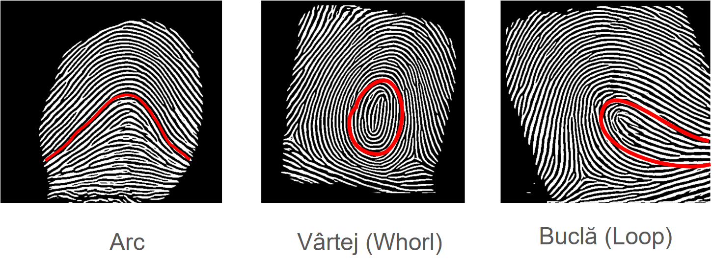
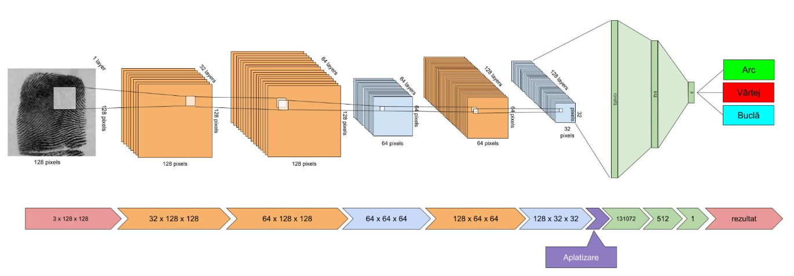

# Clasificator pentru amprente digitale 

## Proiectul

Proiectul reprezintă un sistem de clasificare a amprentelor digitale in trei categorii:



Această clasificare a amprentelor provine din clasele pe care le ofera NIST DB4 (cel putin varianta încă disponibilă a acestui set de date). 

## Execuție

```bash
python infer_dir.py -m ../../../TRAINED_MODELS/Fingerprints/fingerprint_classifier.pth  -df ../../../DATA/fingerprints/NISTDB4_RAW/test_set/class2_whorl/
```

## Structura rețelei neuronale



Această rețea este simplă, dar eficientă pentru sarcini de clasificare a imaginilor de amprente în mai multe categorii (de exemplu, clasificare biometrică). Rețeaua poate fi extinsă sau modificată cu ușurință pentru a se adapta altor dimensiuni de intrare, alte dimensiuni ale embedding-ului sau un număr diferit de clase.

Rețeaua procesează imagini în tonuri de gri (un singur canal) de dimensiune pătrată (implicit 128x128 pixeli) și clasifică fiecare imagine într-una dintre cele num_classes (implicit 3 clase posibile).

### Arhitectură:

### Bloc convoluțional:

Blocul convoluțional al rețelei are rolul de a transforma treptat imaginea de intrare din punct de vedere spațial și semantic. Pornind de la o imagine de dimensiune 128×128×1 (imagini grayscale), prin aplicarea succesivă a operațiilor de convoluție, activare și pooling, rețeaua reduce dimensiunea spațială a imaginii (înălțime și lățime), în timp ce crește numărul de canale (adâncimea). Această transformare nu este doar o simplă reducere de dimensiune, ci mai degrabă o reorganizare a informației: datele brute din imagine sunt reinterpretate și redistribuite în canale multiple care codifică trăsături (features) din ce în ce mai abstracte. Astfel, dimensiunea finală a ieșirii convoluționale ajunge, de exemplu, la 32×32×128 — o reprezentare condensată, dar mai bogată semantic, a imaginii originale.

Blocul convoluțional conține trei straturi convoluționale, fiecare urmat de o funcție de activare ReLU. După al doilea și al treilea strat convoluțional se aplică pooling (MaxPool2d) pentru reducerea dimensiunii. Dimensiunile canalelor cresc astfel: 1 → 32 → 64 → 128, adaptând progresiv reprezentarea imaginii.

Ultimul strat are 32 de pixeli, un stat relativ mare, datorită structurilor relativ reduse ale amprentelor. 

### Bloc Complet Conectat 

După straturile convoluționale, ieșirea este aplatizată (Flatten). Aceasta este urmată de un strat Linear care generează un spațiu de embedding (implicit 512 dimensiuni), urmat de ReLU. Ultimul strat este un strat linear care generează logits pentru fiecare clasă (nu se aplică sigmoid deoarece se presupune o clasificare multi-clasă).


## Antrenare

```bash
python train.py -m face_model.pth -id ../../../DATA/fingerprints/NISTDB4 -ep 10
```


