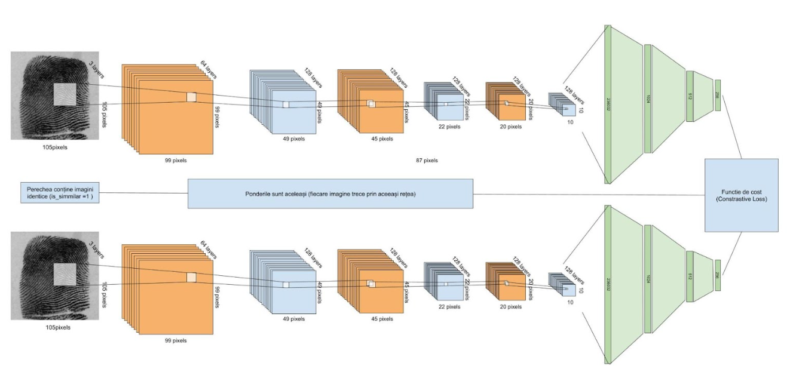

# Identificator pentru amprentele digitale

Identificatoarele, spre deosebire de clasificatoare, încearcă să identifice un singur element dintr-o bază de date care poate fi asociat unei imagini de test. La limita, identificarea poate fi privită ca o clasificare în care numărul de clase este egal cu numărul de eșantioane din baza de date. Orice proces de identificare se bazează pe extragerea unui set de caracteristici din imaginea de test și compararea acelor caracteristici cu seturile corespunzătoare extrase din baza de date. 

În general, rețelele neuronale utilizate la clasificare încearcă să producă embedding-uri căt mai apropiate pentru elementele aceleiași clase. Identificarea solicită puțin altceva - valorile embedding-urilor trebuie să fie suficient de diferite în cazul oricărei perechi de elemente. De aceea este necesară o arhitectură aparte a unei rețele neuronale care să "împingă" seturile de numere cât de departe unul de celălalt. 

O astfel de arhitectură este cea a unei rețele siameze. Acest tip de rețea prelucrează concomitent două imagini, fie etichetate ca fiind același obiect, fie etichetate ca fiind diferite. Funcția de cost este calibrată astfel încăt să crească distanța dintre seturile de embedding-uri ale elementelor diferite. 



# Inferență

```bash
 python test.py -m ../../../TRAINED_MODELS/Fingerprints/siamese_model_min_loss_128.pth -id ../../../DATA/fingerprints/NISTDB4_fragment/ -if ../../../DATA/fingerprints/NISTDB4_fragment/test_images/class1_Arc/class1_Arc_0010_v4.png
 ```

```bash
usage: test.py -m <model file> -df <images directory>

Identificarea unei amprente într-o colecție existentă

options:
  -h, --help            show this help message and exit
  -m MODEL_FILE, --model_file MODEL_FILE
                        Fișierul care conține modelul
  -if INPUT_FILE, --input_file INPUT_FILE
                        Imaginea de test
  -id INPUT_DIRECTORY, --input_directory INPUT_DIRECTORY
                        Directorul cu imagini ale bazei de date
  -e EMBEDDING_SIZE, --embedding_size EMBEDDING_SIZE
                        Dimensiunea stratului de embeddings
  -k TOP_K, --top_k TOP_K
                        Numărul de imagini afișate în topul celor care sunt asemănătoare

Programul extrage embedding-urile dintr-o imagine de test și le compară cu embedding-urile extrase cu aceeași rețea neuronală din imaginile din baza de date
```

# Antrenament

```bash
python train.py -id ../../../DATA/fingerprints/NISTDB4/ -ep 10 -bs 32 -lr 0.001
```

Toate optiunile acestui fisier

```bash
usage: train.py -m <model file> -id <images directory> -ep 10

Program de antrenament pentru reteaua neuronala siameză de identificare a amprentelor.

options:
  -h, --help            show this help message and exit
  -m MODEL_FILE, --model_file MODEL_FILE
                        Calea intreaga (inclusiv numele fisierului) catre modelul de antrenat
  -id INPUT_DIRECTORY, --input_directory INPUT_DIRECTORY
                        Directorul unde se afla datele de antrenament
  -ep EPOCHS, --epochs EPOCHS
                        Numarul de epoci
  -bs BATCH_SIZE, --batch_size BATCH_SIZE
                        Dimensiunea calupului de imagini utilizate în antrenament
  -e EMBEDDING_SIZE, --embedding_size EMBEDDING_SIZE
                        Dimensiunea stratului de embeddings
  -lr LEARNING_RATE, --learning_rate LEARNING_RATE
                        Rata de învățare

Programul utilizeaza un director de imagini pentru a antrena o retea neuronala cu scopul de a identifica amprentele
```

