# Rețele neuronale în clasificarea și detecția fețelor


<!-- TOC -->

- [Rețele neuronale în clasificarea și detecția fețelor](#rețele-neuronale-în-clasificarea-și-detecția-fețelor)
- [Clasificator cu rețele neuronale](#clasificator-cu-rețele-neuronale)
  - [Structura modelului](#structura-modelului)
  - [Cum functioneaza modelul](#cum-functioneaza-modelul)
  - [Rezultate - comentarii](#rezultate---comentarii)
  - [Detectia cu fereastra mobila](#detectia-cu-fereastra-mobila)
    - [Selective Search (folosit în R-CNN)](#selective-search-folosit-în-r-cnn)
    - [Fast R-CNN a optimizat procesul](#fast-r-cnn-a-optimizat-procesul)
    - [Faster R-CNN (introduce RPN)](#faster-r-cnn-introduce-rpn)
      - [NMS (Non-Max Supression)](#nms-non-max-supression)
- [Detecție cu grilă](#detecție-cu-grilă)
  - [Modelul](#modelul)
    - [GridSimpleCNNModel](#gridsimplecnnmodel)
  - [Dimensiunea grilei](#dimensiunea-grilei)
  - [Detecția](#detecția)
  - [Rezultate](#rezultate)
  - [Adaugarea unui extractor convolutional mai complex](#adaugarea-unui-extractor-convolutional-mai-complex)
  - [Concluzii](#concluzii)
    - [Puncte forte:](#puncte-forte)
    - [Limitări:](#limitări)
- [Detector de obiecte cu regresie](#detector-de-obiecte-cu-regresie)
  - [Câmpul receptiv](#câmpul-receptiv)
  - [Functia de cost](#functia-de-cost)
    - [Moduri de exprimare a erorii de detecție](#moduri-de-exprimare-a-erorii-de-detecție)
      - [Exemplu de calcul](#exemplu-de-calcul)
  - [Încărcarea datelor](#încărcarea-datelor)
  - [Modelul](#modelul-1)
    - [Blocul convoluțional](#blocul-convoluțional)
    - [Blocul complet conectat](#blocul-complet-conectat)
  - [Comentarii](#comentarii)
    - [Avantaje:](#avantaje)
    - [Dezavantaje:](#dezavantaje)
  - [Antrenament](#antrenament)
  - [Rezultate](#rezultate-1)
  - [Tranziția către YOLO v1.](#tranziția-către-yolo-v1)

<!-- /TOC -->


# Clasificator cu rețele neuronale

un clasificator este un instrument software care împarte (clasifică) imaginile în mai multe grupuri. In caz particular, acesta este un model cnn care primeste o imagine si detecteaza daca acea imagine conține o față umană. Modelul nu oferă și poziția acelei fețe în imagine (nu conține un element de regresie). 


## Structura modelului

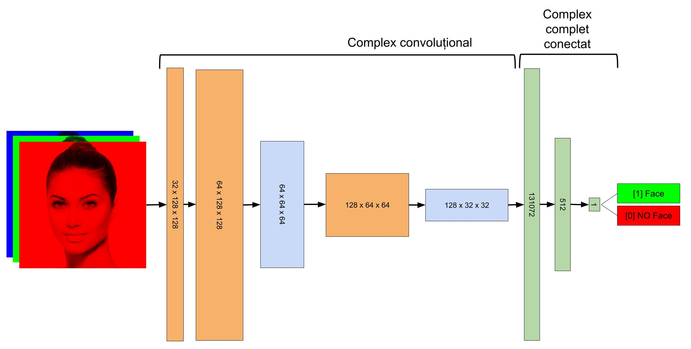


```
==========================================================================================
Layer (type:depth-idx)                   Output Shape              Param #
==========================================================================================
CNNClassifier                            [1, 1]                    --
├─Conv2d: 1-1                            [1, 32, 128, 128]         896
├─Conv2d: 1-2                            [1, 64, 128, 128]         18,496
├─Conv2d: 1-3                            [1, 128, 64, 64]          73,856
├─Linear: 1-4                            [1, 512]                  67,109,376
├─Linear: 1-5                            [1, 1]                    513
==========================================================================================
Total params: 67,203,137
Trainable params: 67,203,137
Non-trainable params: 0
Total mult-adds (Units.MEGABYTES): 687.34
==========================================================================================
Input size (MB): 0.20
Forward/backward pass size (MB): 16.78
Params size (MB): 268.81
Estimated Total Size (MB): 285.79
==========================================================================================
```

## Cum functioneaza modelul

Rețeaua neuronală este compusă din două regiuni diferite: grupul convoluțional și grupul complet conectat. Scopul final al întregii rețele este să producă un număr între 0 (imaginea NU este o față) și 1 (imaginea este o față). Această valoare se obține pe baza unei sume ponderate a valorilor neuronilor din stratul anterior. Valorile din stratul anterior se obțin pe baza unor sume ponderate ale tuturor "neuronilor" din ultimul strat convoluțional iar valorile neuronilor din stratele convoluționale se obțin prin aplicarea unui produs scalar între valorile de unui unei parti din neuronii stratului anterior la care se adauga ponderi, urmată de aplicarea unei funcții de activare. 

Complexul convoluțional este cel care discrimineaza imaginile în funcție de modul de antrenare a rețelei. Componentele acestuia vor fi similare între ele când vor analiza imagini cu fețele și foarte diferite când vor analiza imagini care nu conțin fețe. 

Complexul complet conectat are ca scop sumarizarea informației din complexul convoluțional astfel încât să se păstreze semnificația. 

Penultimul strat din complexul conectat poate avea o cantitate variabilă de neuroni. Valorile acestora sunt foarte apropiate într ele în cazul imaginilor cu fețe și foarte diferite în cazul imaginilor care nu au fețe. Acești vectori reprezintă corect fiecare față și se pot utiliza pentru a reprezenta aceste imagini. Acest gen de vectori se numesc "embeddings". 

Având în vedere că ultimul strat din complexul conectat conține un singur neuron, ne așteptăm ca în cazul detecțiilor pozitive acesta sa fie obținut prin aproximativ aceeași colecție de neuroni "activați" din stratul complet conectat anterior. 

În imaginea următoare,, cu culoarea roșie se vede activarea stratului conectat (cel numit embeddings) în varianta în care acesta are 512. Cu culoarea verde sunt vector în care modelul a detectat corect fețe umane, cu culoarea galbenă este un fals pozitiv (modelul a declarat că imaginea conține o față dar în realitate aceasta conținea o mașină de gătit.) iar cu roșu sunt vectori obținuți în cazul imaginilor care au fost corect etichetate ca neconținând fețe umane. Fiecare dungă verticală din imagine reprezintă o detecție iar fiecare linie orizontală din acestea are intensitatea determinată de valoarea neuronului respectiv (1 pentru cele foarte luminoase, 0 pentru cele complet întunecate).


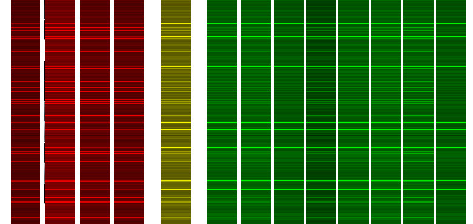

La o analiză atentă se observă similarități semnificative între vectorii corespunzători detecțiilor pozitive. Detecțiile negative (deși la prima vedere destul de similare) sunt în realitate destul de diferite de cele pozitive și destul de diferite între ele. Această situație este mult mai clară dacă reducem semnificativ numărul de neuroni din stratul de embeddings. 

Vectorul final de embeddings poate fi redus semnificativ, caz in care este mult mai evidentă diferența dntre detecțiile negative și cele pozitive. Se observă și în acest caz că detecția fals pozitivă are o distribuție a valorilor asemănătoare detecțiilor pozitive. 

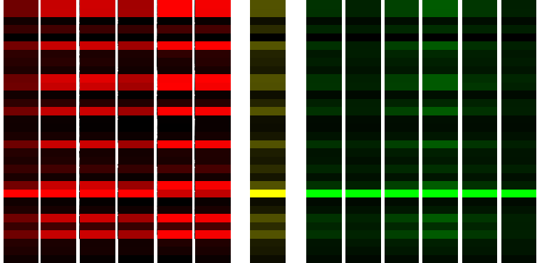

Stratele convoluționale se activează în funcție de imaginea procesată

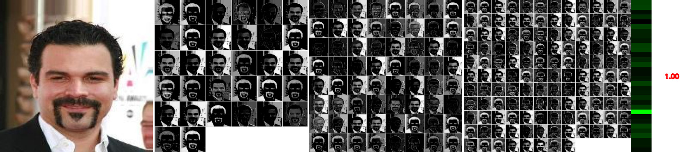

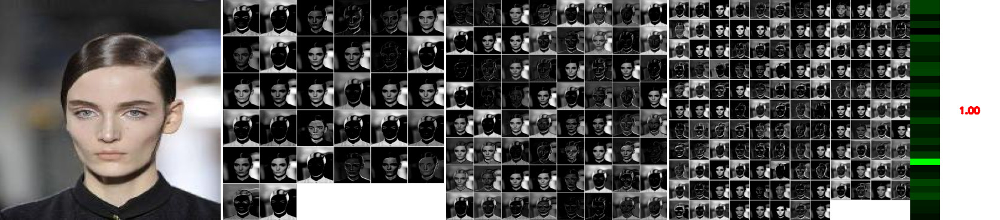

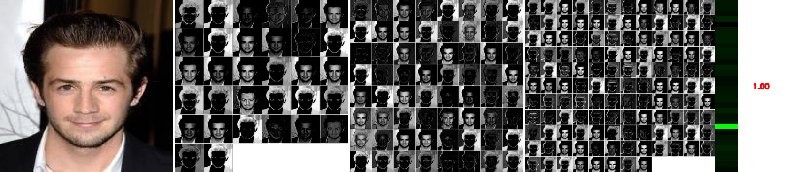
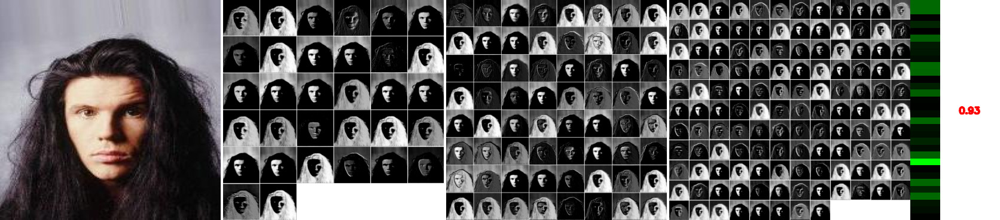

Detecții negative

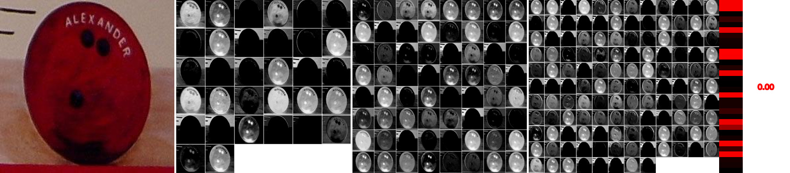

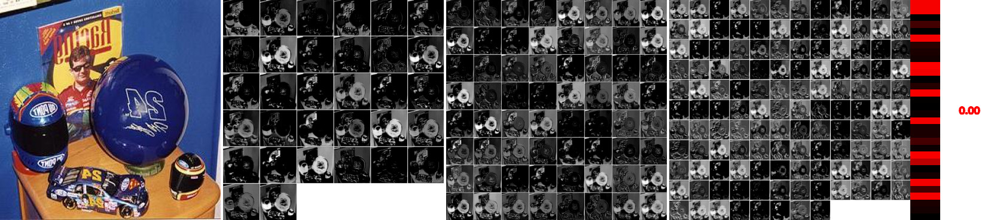

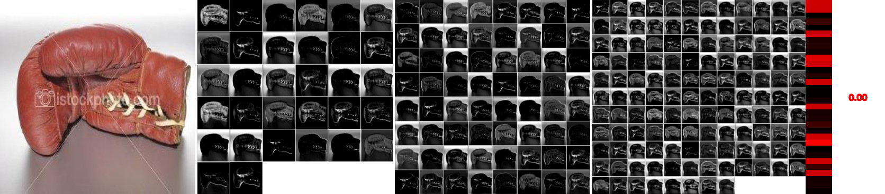

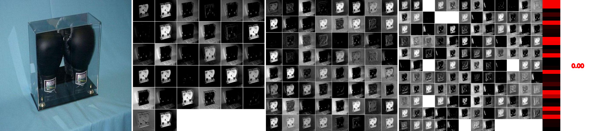

## Rezultate - comentarii

Problema modelelor de clasificare este că nu pot detecta obiectele căutate decât dacă imaginile analizate conțin fețele încadrate la fel ca în imaginile utilizate la antrenament. De exemplu, reîncadrarea unei imagini o face să se modifice din nedetectată în detectată.

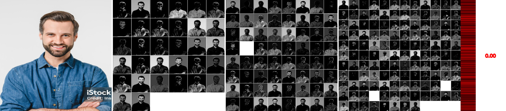

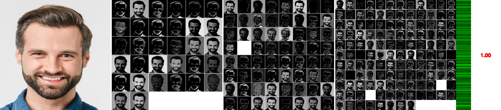

Reîncadrarea imaginii o face din nou să nu mai fie identificată. 

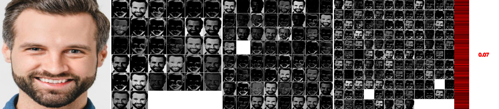

Dacă reantrenăm rețeaua folosind imagini cu încadrare mai strânsă fața este din nou detectată, cu un scor semnificativ mai mic (dar se pierde posibilitatea detecției fețelor încadrate mai larg). 


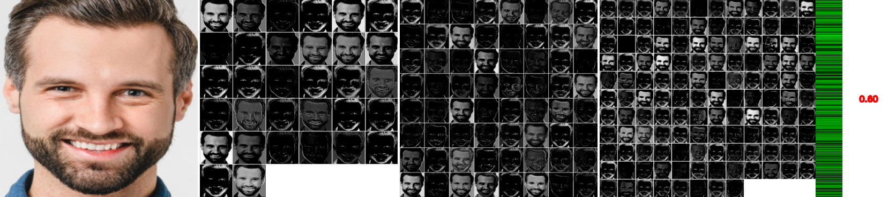

O altă posibilitate este dublarea numărului de imagini de antrenament, fiind prezente atât cele cu încadrare strânsă cât și cele cu încadrare largă. Aceasta va determina o generalizare a modelului și va putea identifica ambele tipuri de încadrare. 

## Detectia cu fereastra mobila

Detectia cu fereastra mobila poate fi folosita ca un substitut de regresie pentru a identifica casetele care contin obiecte (fețe). Aceasta implica baleierea unei imagini cu un pătrat de rezoluții variate, extragerea conținutului acestuia și procesarea imaginii rezultate ca o imagine de sine statatoare. Daca fragmentul conține o față, caseta curenta este înregistrată. 

Aceasta metoda este foarte lenta dar poate fi surprinzator de precisa în situația in care casetele de detectie alese se potrivesc cu dimensiunea fețelor din imagine și în condițiile în care se construiește un algoritm NMS care să facă un sumar corect al casetelor la rezoluții foarte diferite. 

De asemenea, clasificatorul trebuie să fie antrenat cu imagini uniforme, de exemplu se pot alege imagini în care fețele umane sunt marcate "larg" - lăsându-se un spațiu în jurul capului sau dimpotrivă foarte "strâns" selectând doar fața lăsând la o parte părul, etc. Teoretic se pot amesteca ambele marcaje dar în majoritatea situațiilor detecțiile provenite de la antrenamentele cu ferestre largi le vor acoperi pe celelalte. 

In timpul detectiei diferitelor casete vor aparea mai multe rezultate pozitive. In jurul fiecărei fețe va exista un numar semnificativ de casete pozitive, în funcție de pasul de mutare a ferestrei si ce del de reducere a rezolutiei. 


Rezultatul procesului 

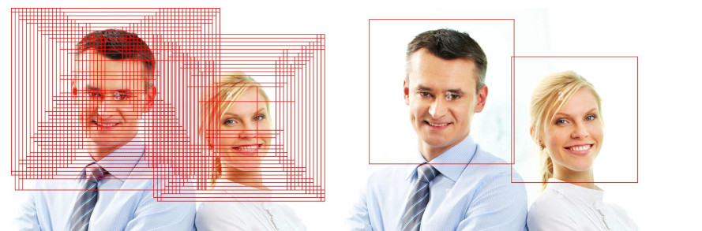

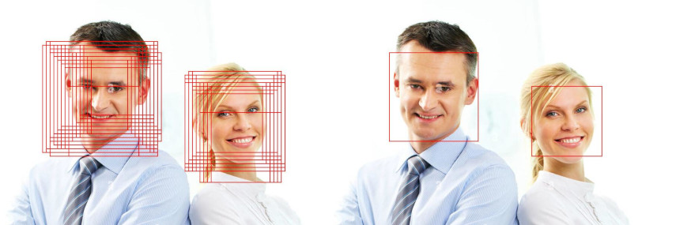


Această soluție (a ferestrei mobile) este utilizată și în alte detectoare (ex. Haar cascades). Evoluând dincolo de metoda ferestrei mobile au fost: 

### Selective Search (folosit în R-CNN)

Ca alternativă la sliding window, a fost introdusă metoda Selective Search, care analiza imaginea și realiza o segmentare ierarhică în regiuni similare, generând sute sau mii de propuneri de regiuni (region proposals) care păreau relevante. Aceste regiuni erau apoi trecute printr-un CNN pentru a fi clasificate.

### Fast R-CNN a optimizat procesul

În loc să aplice CNN-ul de fiecare dată pe fiecare regiune, se aplica o singură dată pe întreaga imagine. Se extrăgeau feature maps, iar din ele se obțineau vectori pentru fiecare regiune (prin ROI Pooling). Clasificarea și regresia se făceau într-o singură rețea completă.

### Faster R-CNN (introduce RPN)
Faster R-CNN a fost o revoluție: a introdus RPN (Region Proposal Network), care înlocuia Selective Search cu o rețea neuronală care genera automat regiuni de interes. RPN-ul era complet convoluțional și învăța să propună cutii bounding box relevante. A fost primul sistem end-to-end trainable cu propuneri de regiuni integrate. Totuși, era încă un detector în două etape (two-stage detector): întâi propune regiuni, apoi le clasifică.

Imaginea trece o singură dată printr-un backbone CNN (ex: VGG16 sau ResNet). Rezultatul este o hartă de caracteristici (feature map), care este apoi folosită atât de RPN, cât și de clasificatorul Fast R-CNN. Peste feature map, rulează o fereastră de convoluție 3×3 (sliding window).

La fiecare locație, sunt plasate mai multe ancore (cutii predefinite de diferite dimensiuni și proporții). Pentru fiecare ancoră, rețeaua prezice: Scor de obiect (dacă există un obiect acolo). Corecții pentru coordonatele ancorei (bounding box refinement). După aplicare, se selectează cele mai bune propuneri (~300 per imagine) folosind Non-Max Supression

#### NMS (Non-Max Supression)

NMS (non-max suppression) este un pas folosit în detectarea obiectelor pentru a elimina casetele de detecție care se suprapun prea mult. De exemplu, dacă două casete detectează același obiect, dar au scoruri diferite de încredere, algoritmul păstrează doar caseta cu scorul mai mare. Cealaltă casetă este eliminată dacă suprapunerea dintre ele, măsurată prin IoU (Intersection over Union), este prea mare. IoU reprezintă raportul dintre suprafața comună a celor două casete și suprafața totală acoperită de ambele; un IoU mare înseamnă că cele două casete detectează același obiect. Astfel, rămâne doar cea mai bună detecție pentru fiecare obiect.


# Detecție cu grilă

Instrumentele capabile să clasifice imaginile în funcție de conținutul acestora sunt foarte dependente de încadrarea subiectelor în imagine. Acestea nu pot identifica regiunea din imagine în care este prezent obiectul căutat și nu pot identifica mai multe obiecte în aceeași imagine. 

Depășirea acestei limitări pleacă de la observația că rețeaua neuronală poate fi antrenată să clasifice imagini în care obiectul este poziționat în mai multe locuri în imagine și aceasta va clasifica corect imaginea. Întrebarea este dacă nu putem antrena rețeaua astfel încât în loc să clasifice întreaga imagine, să clasifice bucăți din imagine. De exemplu, putem trata fiecare imagine ca fiind compusă din 49 de imagini mai mici aranjate într-o matrice de 7 x 7. 

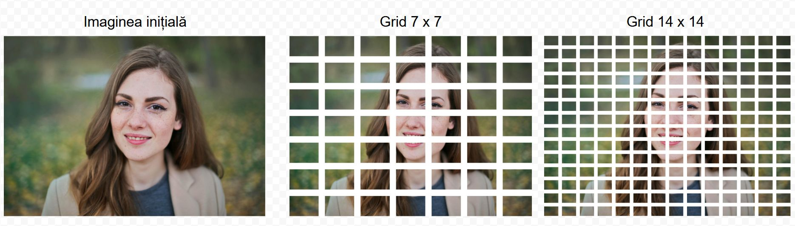

Într-un fel, seamănă cu tehnica ferestrei mobile aplicată la diferite scări. Încă aici, încercăm să introducem acest grid direct în rețeaua neuronală astfel încât aceasta să fie în stare să clasifice fiecare fragment al imaginii ca fiind "fragment de față" sau altceva într-o singură trecere. Pentru aceasta rețeaua trebuie extinsă astfel încât: 

1. complexul convoluțional să fie puțin mai puternic, să fie capabil să observe mai multe detalii la scări mai mici în imagine
2. Stratul complet conectat final (cel care oferă răspunsul), în loc să fie un singur neuron care să conțină probabilitatea ca întreaga imagine să fie pozitivă sau negativă să ofere această probabilitate la nivelul fiecărei celule, adică să fie un strat de n x n valori, unde x este dimensiunea grilei. Fiecare valoare a acestui vector va representa probabilitatea ca celula i,j să conțină un fragment de față umană. 
3. Antrenamentul trebuie să fie special pentru acest tip de detecție. Altfel spus, fiecare imagine introdusă în model ca dată de antrenament trebuie să fie însoțită de specificarea regiunii care conține fața umană. Procesul de citire a datelor trebuie să genereze informații cu privire la prezența feței în diferite celule ale gridului de n x n.  
4. Fiecare valoare a lui n aleasă (dimensiune a grilei) trebuie să fie antrenată separat, producând un model specific.

Modelul permite identificarea unei singure clase de obiecte. Antrenamentul se face pe baza unui set de imagini pozitive care contin specificatii cu privire la casetele in care se gasesc obiectele (bounding boxes). Celulele din imagini care se gasesc in interiorul unei astfel de casete de detectie sunt considerate obiect si sunt marcate cu valoarea 1. Celulele din afara casetelor sunt marcate cu 0 si reprezinta partea negativa a antrenamentului. Această grilă reprezintă un fel de "matrice a adevărului". 

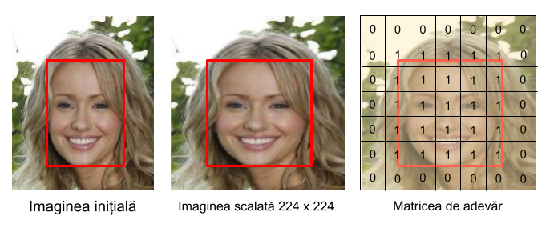

## Modelul

### GridSimpleCNNModel

Modelul este compus dintr-un component convoluțional si un clasificator complet conectat. Rezolutia imaginilor de intrare este 224 de pixeli. 

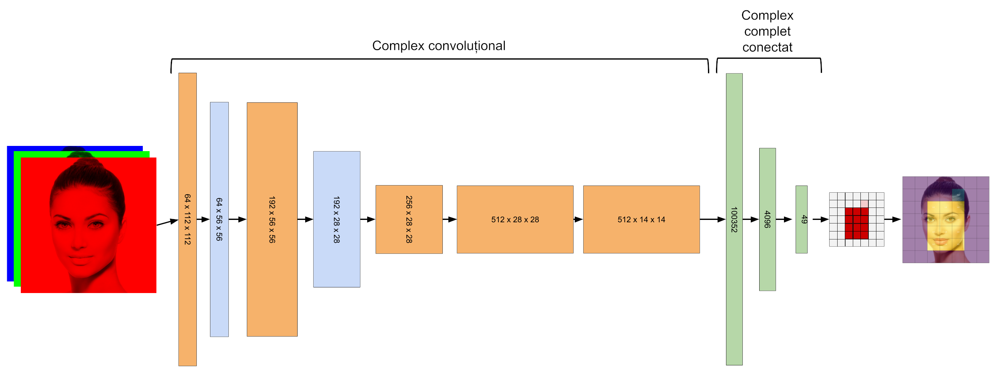

Se observă următoarele: 

Am crescut numărul de strate convoluționale
Am crescut dimensiunea penultimului strat complet conectat de tip "embeddings" la 4096 pentru a oferi o cantitate importantă de ponderi fiecărui neuron din stratul final. 

```
==========================================================================================
Layer (type:depth-idx)                   Output Shape              Param #
==========================================================================================
GridSimpleCNNModel                       [1, 7, 7]                 --
├─Sequential: 1-1                        [1, 512, 14, 14]          --
│    └─Conv2d: 2-1                       [1, 64, 112, 112]         9,472
│    └─LeakyReLU: 2-2                    [1, 64, 112, 112]         --
│    └─MaxPool2d: 2-3                    [1, 64, 56, 56]           --
│    └─Conv2d: 2-4                       [1, 192, 56, 56]          110,784
│    └─LeakyReLU: 2-5                    [1, 192, 56, 56]          --
│    └─MaxPool2d: 2-6                    [1, 192, 28, 28]          --
│    └─Conv2d: 2-7                       [1, 256, 28, 28]          442,624
│    └─LeakyReLU: 2-8                    [1, 256, 28, 28]          --
│    └─Conv2d: 2-9                       [1, 512, 28, 28]          1,180,160
│    └─LeakyReLU: 2-10                   [1, 512, 28, 28]          --
│    └─MaxPool2d: 2-11                   [1, 512, 14, 14]          --
├─Sequential: 1-2                        [1, 49]                   --
│    └─Flatten: 2-12                     [1, 100352]               --
│    └─Linear: 2-13                      [1, 4096]                 411,045,888
│    └─ReLU: 2-14                        [1, 4096]                 --
│    └─Linear: 2-15                      [1, 49]                   200,753
│    └─Sigmoid: 2-16                     [1, 49]                   --
==========================================================================================
Total params: 412,989,681
Trainable params: 412,989,681
Non-trainable params: 0
Total mult-adds (Units.GIGABYTES): 2.15
==========================================================================================
Input size (MB): 0.60
Forward/backward pass size (MB): 16.09
Params size (MB): 1651.96
Estimated Total Size (MB): 1668.65
==========================================================================================
```

## Dimensiunea grilei

Dimensiunea gridului influenteaza calitatea rezultatelor obtinute. 

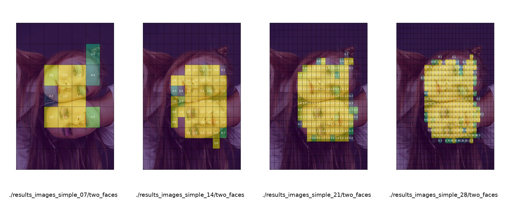

## Detecția

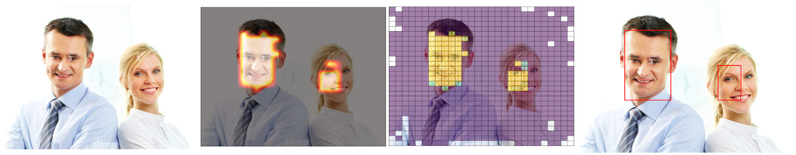


Detecția obiectelor însă implică izolarea corectă a acestora. Aceasta înseamnă obținerea unor casete care să conțină fețele identificate. Modelul AI nu permite aceasta, extracția casetelor se poate face în postprocesare. Există mai mulți algoritmi pentru aceasta, în general numiți "Connected Component Labeling". infer.py implementeaza un astfel de algoritm care funcționeaza în esență astfel: 

- modifică matricea astfel încât aceasta să conțină numai valori 0 sau 1
- parcurge matricea rând cu rând până la identificarea primei valori de 1
- înregistrează această celulă într-o listă de celule vizitate
- analizează toți pixelii vecini ai pixelului curent și vede dacă vreunul este 1. Acesta va fi conectat în același obiect. 
- se muta pe unul dintre pixelii cu valoarea 1. 
- înregistreaza acest pixel in lista celulelor vizitate. 
- extinde caseta cu acest pixel. 

in momentul in care se întâlnește un pixel care nu are nici un vecin cu 1 nevizitat regiunea curenta se termina

Programul face o astfel de analiza si produce o imagine care contine aceste casete suprapuse peste imaginea initiala. In anumite situatii rezultatele sunt satisfacatoare, in alte situatii acestea sunt complet gresite. 

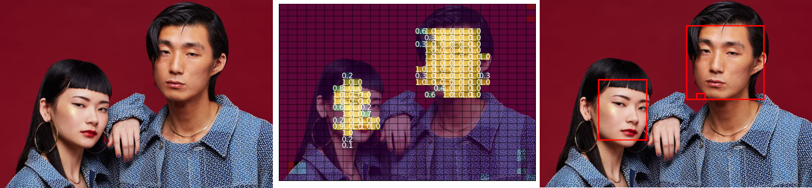

## Rezultate

Modalitatea de detectie bazata pe grid este o treapta intermediara intre clasificare si detectie a obiectelor. Rezultatele detectiei bazate pe grid nu pot fi utilizate direct (aceasta nu produce casete cu detectii). Acestea se pot obtine prin analiza ulterioara a matricii de detectie si extragerea casetelor in masura in care celulele sunt conectate. 

Influenta densitatii gridului asupra calitatii detectiei este de cele mai multe ori clara. Sunt situatii in care reteaua mai deasa nu influenteaza foarte mult

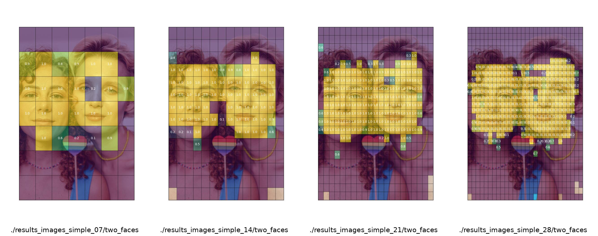


In alte situatii cresterea densitatii retelei conduce la o detectie mult mai buna, acoperind suprafete nedetectate la densitati mai reduse. In special in cazul in care se trece de la 7 la 14

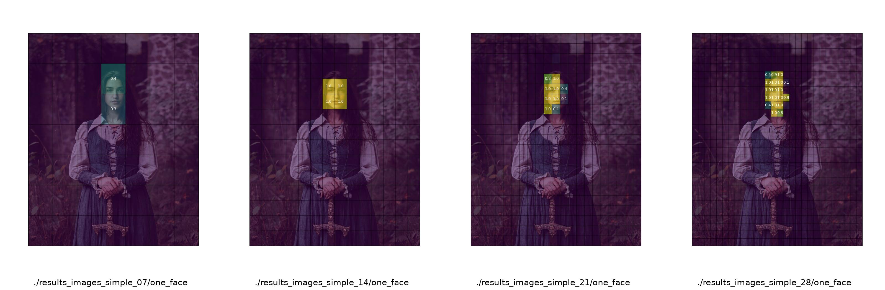

Sunt situatii in care detectia esueaza si structurile vizuale pe care le detecteaza modelul sunt gresite in mod constant, indiferent de densitatea retelei


Sunt situatii in care detectiile la densitati reduse sunt incomplete dat la densitati ridicate sunt complete


Sunt situatii in care la densitati reduse anumite obiecte nu sunt detectate deloc in timp ce la densitati mai ridicate sunt detectate in timp ce alte fete nu sunt detectate indiferent de scara. 

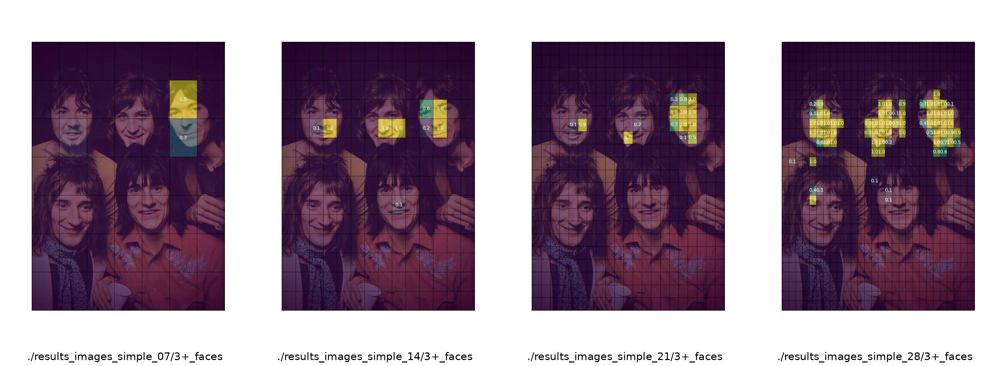

Datorita modului de detectie (in esenta detectia este facuta celula cu celula) doua fete apropiate vor fi detectate ca fiind o singura regiune iar un algoritm de postprocesare le va trata ca pe o singura caseta, adica un singur obiect. 

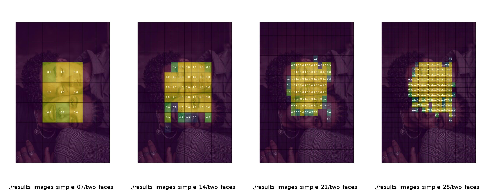

Dupa cum sunt situatii in care falsurile pozitive se accentueaza cu cresterea densitatii retelei. 

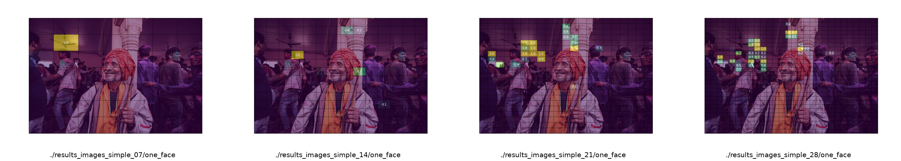

## Adaugarea unui extractor convolutional mai complex

Adaugatea unui extractor convolutional mai complex (cu mai multe straturi/filtre) va imbunatati procesul de recunoastere. 


----
Extractor CNN Simplu

Extractor CNN extins
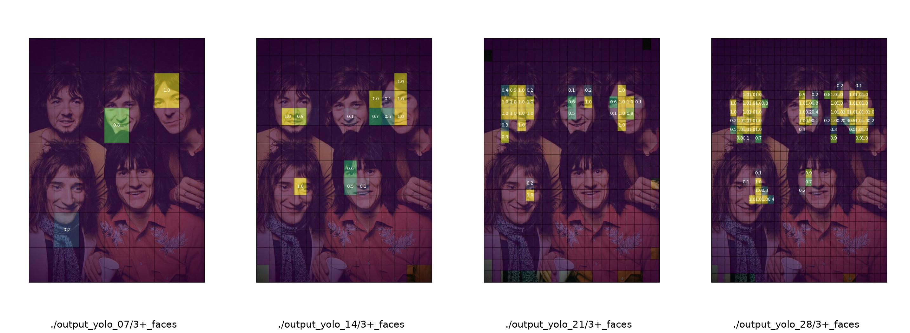

----
Extractor CNN Simplu

Extractor CNN extins
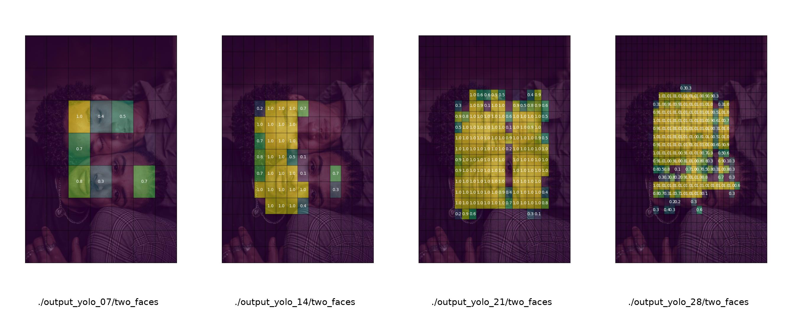


----

Extractor CNN Simplu

Extractor CNN extins
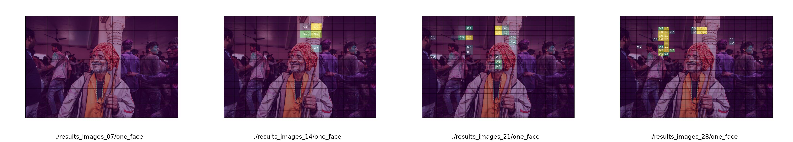


## Concluzii

### Puncte forte:

**Simplitate:** Este o modalitate directă de a începe abordarea problemei. Grila oferă o localizare relativ grosieră a potențialelor fețe.
**Ieșire directă:** Cele n x n de valori de ieșire corespund direct probabilității ca o față să fie prezentă în fiecare celulă a grilei. Acest lucru face ca interpretarea inițială a rezultatului rețelei să fie destul de clară.
**Natura convoluțională:** Rețelele convoluționale excelează în învățarea ierarhiilor spațiale de caracteristici. Ele pot învăța să detecteze trăsături faciale de bază (ochi, nas, gură) în câmpuri receptive mai mici și apoi să le combine pentru a identifica modele mai mari asemănătoare feței în celulele grilei.
**Filtrare inițială:** Această abordare poate filtra eficient porțiuni mari ale imaginii care în mod clar nu conțin fețe, reducând spațiul de căutare pentru o localizare mai precisă ulterioară.

### Limitări: 

**Localizare grosieră:** O grilă de dimensiuni reduse oferă casete de delimitare foarte aproximative. O față ar putea acoperi mai multe celule ale grilei, sau o singură celulă a grilei ar putea conține doar o mică parte a unei fețe. Nu vom obține coordonate precise sau dimensiuni ale fețelor detectate direct din această ieșire.
**Gestionarea mai multor fețe:** Dacă apar mai multe fețe în imagine, fiecare față ar putea activa mai multe celule adiacente ale grilei. Mecanismul de postprocesare este dependent de o separare foarte bună a fețelor.
**Scala și raportul de aspect al feței:** Fețele au diferite dimensiuni și rapoarte de aspect. O grilă fixă, mai ales una de dimensiuni reduse, ar putea avea dificultăți în a reprezenta cu precizie fețe foarte mici sau cu proporții neobișnuite.
**Fals pozitive:** Unele obiecte sau texturi care nu sunt fețe ar putea declanșa o probabilitate ridicată în anumite celule ale grilei, ducând la fals pozitive.


# Detector de obiecte cu regresie 

In modelul cu grila, ne bazam pe faptul că o mică porțiune a unei imagini (o celulă a acelui grid) poate codifica suficientă informație în urma antrenamentului pentru a detecta faptul că aceasta face parte dintr-o față. În esență, detectorul cu grilă este un clasificator cu mai multe clase, câte una pentru fiecare parte a unei fețe (ochi, vârful nasului, etc.). Am văzut care sunt deficiențele acestui model și încercăm să vedem cum putem îmbunătăți acest proces. 

Pentru aceasta, trebuie să observăm că într-o rețea neuronală fiecare neuron (corespunzător de exemplu unei celule în grila modelului cu grile) este "conectat" cu regiuni relativ crescute din imaginea inițială. Suprafața din imaginea inițială care este conectată cu 

Aceasta înseamnă că această celulă va "învăța" din suprafețe extinse ale imaginii. Dacă această celulă este în centrul unei fețe, ea va fi influențată de dimensiunea totală a feței din care face parte. 

## Câmpul receptiv

În imaginea următoare se observă cum, deși stratele convolutionale se reduc în rezoluție, ele conțin informații din întreaga imagine inițială. 

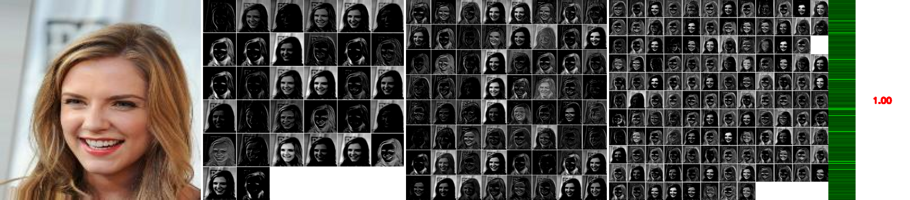

Câmpul receptiv al unui neuron (sau al unei unități) dintr-un anumit strat reprezintă regiunea specifică din spațiul de intrare (cum ar fi imaginea originală sau o hartă de caracteristici dintr-un strat anterior) care influențează valoarea de activare a acelui neuron.

Ne putem imagina că fiecare neuron din rețea are o "fereastră" prin care se uită la stratul anterior. Câmpul receptiv este dimensiunea și localizarea acelei ferestre în acel strat anterior.

În straturile convoluționale, fiecare neuron este conectat doar la o regiune locală a stratului precedent, nu la întreaga hartă de caracteristici. Această regiune locală este câmpul său receptiv.
Creștere în profunzime: Pe măsură ce ne deplasăm prin straturi mai adânci ale rețelei, câmpul receptiv al unui neuron devine progresiv mai mare în raport cu imaginea de intrare originală. Acest lucru se întâmplă deoarece fiecare neuron din stratul curent primește informații de la un câmp receptiv din stratul anterior, care la rândul său a "văzut" o regiune din stratul și mai anterior, și așa mai departe.

Înțelegerea câmpului receptiv este crucială pentru a proiecta arhitecturi eficiente de rețele. Trebuie să ne asigurăm că neuronii din straturile finale au un câmp receptiv suficient de mare pentru a cuprinde informațiile relevante pentru sarcina respectivă (de exemplu, o față întreagă pentru detectarea fețelor).

Factori care influențează dimensiunea câmpului receptiv:
Dimensiunea kernelului (filtrului) convoluțional: Un kernel mai mare mărește direct câmpul receptiv al neuronilor din acel strat.
Pasul (stride) convoluției: Un pas mai mare face ca neuronii din stratul următor să "vadă" regiuni mai îndepărtate în stratul precedent, ducând la o creștere mai rapidă a câmpului receptiv în straturile mai adânci.
Operațiuni de pooling: Straturile de pooling reduc dimensiunea hărților de caracteristici, ceea ce poate influența indirect dimensiunea câmpului receptiv în straturile ulterioare.

Având în vedere toate acestea, putem antrena rețeaua neuronală astfel încât, pentru fiecare celulă din grila să prezică nu doar apartenența acesteia la o anumită categorie dar si dimensiunile casetei care încadrează întreg obiectul (față) din care face parte fragmentul curent. 

Prima model de rețea convoluțională care a propus acest mod de antrenament/inferență a fost YOLO (You only look Once). Modelul implementat aici este o simplificare a YOLO dar direct inspirat din acesta.  

## Functia de cost

Această funcție de cost (YOLOFaceLoss) este concepută pentru a antrena un model de tip YOLO adaptat pentru detectarea fețelor într-o imagine, unde fiecare celulă a unei grile bidimensionale decide dacă există o față și estimează poziția și dimensiunile acesteia. Funcția ia în considerare atât celulele care conțin fețe, cât și cele care nu conțin, aplicând penalizări diferite în funcție de situație.

Funcția de cost trebuie calibrată astfel încât să penalizeze atât o detecție falsă într-o celulă cât și propunerea unui set de coordonate ale casetei feței neconform cu ceea ce conțin datele de antrenament. 

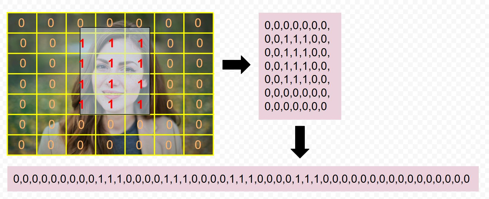

### Moduri de exprimare a erorii de detecție

#### Exemplu de calcul

Presupunem că vectorul care reprezintă adevărul este: 

t = [ 0, 1, 0, 1 ]

iar cel care reprezintă predicțiile este:

p = [ 0.2, 0.4, 0.1, 0.7 ]

Cum am putea exprima diferența dintre cei doi vectori? In primul rând trebuie să observăm că semnul diferenței nu contează ne interesează contrastul dintre detecție și realitate. Putem încerca să utilizăm eroarea medie absolută: 

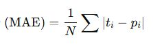

sau eroarea medie pătratică: 

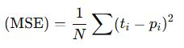

Ambele aceste calcule însă tratează toate erorile în mod egal ceea ce în clasificare nu este bine. În clasificări ne dorim să maximizăm șansa ca modelul să prezică în mod corect.  

- Dorim să răsplătim predicțiile corecte cu încredere mare
- Dorim să penalizăm sever predicțiile greșite cu încredere mare

BCE (Binary Cross Entropy Loss) are aceste caracteristici:

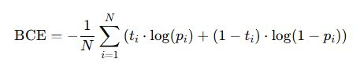

Observăm că formula conține o sumă de doi termeni. 

Să calculăm fiecare termen: 

| t | p   |  termen 1                |  termen 2                 | valoare finala           |
|---|-----|--------------------------|---------------------------|--------------------------|
| 0 | 0   |   0 * log(0.2) = 0       |  1 * log(0.8) ~= -0.2231  | -(0 + -0.2231) = 0.2231  | 
| 1 | 0.4 | 1 * log(0.4) ~= -0.9163  |  0 * log(0.6) = 0         | -(-0.9163 + 0) = 0.9163  |
| 0 | 0.1 | 0 * log(0.1) = 0         |  1 * log(0.9) ~= -0.1054  | -(0 + -0.1054) = 0.1054  |
| 1 | 0.7 | 1 * log(0.7) ~= -0.3567  |  0 * log(0.3) = 0         | -(-0.3567 + 0) = 0.3567  |

Si acum suma finală: 

BCE = (0.2231 + 0.9163 + 0.1054 + 0.3567) / 4 = 0.4004

Funcția de cost primește ca intrare doi tensori: pred (predicțiile modelului) și target (valorile reale), fiecare de dimensiune (batch, grid_size, grid_size, 5), unde cei cinci coeficienți reprezintă: probabilitatea prezenței unei fețe, coordonatele centrului (x, y) și dimensiunile (lățime, înălțime) ale feței în cadrul celulei.

Se definesc două tipuri de măști:

 - obj_mask identifică celulele unde o față este prezentă (valoarea probabilității reale este mai mare decât zero).
 - no_obj_mask identifică celulele unde nu există față (valoarea probabilității reale este zero).

Pentru celulele care conțin fețe, se calculează:

 - pierdere de coordonate: penalizează diferențele dintre predicțiile și valorile reale pentru x, y, lățime și înălțime, folosind MSE (Mean Squared Error - Eroarea patratica medie), multiplicat cu un factor lambda_coord, ce controlează cât de mult contează acest termen în totalul pierderii.
 - pierdere pentru scorul de încredere (obj_loss): evaluează cât de bine estimează modelul probabilitatea că o față este prezentă într-o celulă. Se folosește Binary Cross Entropy (BCE) între valoarea prezisă și cea reală.

Pentru celulele care nu conțin fețe, se calculează:

pierdere pentru absența obiectului (no_obj_loss): penalizează predicțiile false pozitive (adică atunci când modelul prezice o față acolo unde nu este). Se aplică BCE, ponderat cu un coeficient lambda_noobj, care este în mod normal foarte mic pentru a nu domina pierderea totală.

La final, funcția adună cele trei componente de pierdere și returnează pierderea totală împreună cu fiecare componentă individuală, oferind astfel o imagine detaliată asupra contribuției fiecărui tip de eroare. Este implementat și un mecanism de detectare a valorilor NaN, pentru a identifica eventualele probleme numerice în timpul antrenării.

## Încărcarea datelor

Încărcarea datelor se face cu ajutorul clasei YOLODataset care primește ca argumente directoarele cu imagini și etichete împreună cu funcția de transformare a imaginilor. 

Fișierele cu casetele marcate conțin câte o linie pentru fiecare casetă. Acestea arată astfel: 

```
1 0.10546875 0.7637931034482759 0.072265625 0.06413793103448276
1 0.49755859375 0.07724137931034483 0.0830078125 0.07310344827586207
1 0.8408203125 0.5186206896551724 0.078125 0.0703448275862069
```

Prima coloană este clasa din care face parte obiectul din caseta corespunzătoare (în cazul antrenării detectoarelor de fețe acestea vor fi 1 de fiecare dată) urmat de două coordonate ale centrului casetei si de lățimea și înălțimea acesteia. Cele patru valori sunt subunitare pentru că sunt normalizate la dimensiunea imaginii. 

## Modelul 

```
==========================================================================================
Layer (type:depth-idx)                   Output Shape              Param #
==========================================================================================
YOLOFaceCNN                              [1, 7, 7, 5]              --
├─Sequential: 1-1                        [1, 512, 14, 14]          --
│    └─Conv2d: 2-1                       [1, 64, 112, 112]         9,472
│    └─LeakyReLU: 2-2                    [1, 64, 112, 112]         --
│    └─MaxPool2d: 2-3                    [1, 64, 56, 56]           --
│    └─Conv2d: 2-4                       [1, 192, 56, 56]          110,784
│    └─LeakyReLU: 2-5                    [1, 192, 56, 56]          --
│    └─MaxPool2d: 2-6                    [1, 192, 28, 28]          --
│    └─Conv2d: 2-7                       [1, 128, 28, 28]          24,704
│    └─LeakyReLU: 2-8                    [1, 128, 28, 28]          --
│    └─Conv2d: 2-9                       [1, 256, 28, 28]          295,168
│    └─LeakyReLU: 2-10                   [1, 256, 28, 28]          --
│    └─Conv2d: 2-11                      [1, 256, 28, 28]          65,792
│    └─LeakyReLU: 2-12                   [1, 256, 28, 28]          --
│    └─Conv2d: 2-13                      [1, 512, 28, 28]          1,180,160
│    └─LeakyReLU: 2-14                   [1, 512, 28, 28]          --
│    └─MaxPool2d: 2-15                   [1, 512, 14, 14]          --
├─Sequential: 1-2                        [1, 245]                  --
│    └─Flatten: 2-16                     [1, 100352]               --
│    └─Linear: 2-17                      [1, 4096]                 411,045,888
│    └─BatchNorm1d: 2-18                 [1, 4096]                 8,192
│    └─LeakyReLU: 2-19                   [1, 4096]                 --
│    └─Linear: 2-20                      [1, 245]                  1,003,765
│    └─Sigmoid: 2-21                     [1, 245]                  --
==========================================================================================
Total params: 413,743,925
Trainable params: 413,743,925
Non-trainable params: 0
Total mult-adds (Units.GIGABYTES): 2.11
==========================================================================================
Input size (MB): 0.60
Forward/backward pass size (MB): 18.53
Params size (MB): 1654.98
Estimated Total Size (MB): 1674.11
==========================================================================================
```

### Blocul convoluțional

| Dimensiune ieșire (Output Shape)   |	Descriere strat Conv2d |
|------------------------------------|-------------------------|
|[1, 64, 112, 112]	|  Primul strat convoluțional — extrage caracteristici de bază (muchii, texturi) din imaginea de intrare. Este un strat cu un număr mic de filtre (64) pentru procesare inițială. |
|[1, 192, 56, 56]	|  Extrage caracteristici intermediare. Crește numărul de filtre pentru a învăța reprezentări mai bogate. |
|[1, 128, 28, 28]	|  Reduce temporar numărul de canale pentru diversificare a caracteristicilor. |
|[1, 256, 28, 28]	|  Adaugă profunzime semnificativă în reprezentarea caracteristicilor spațiale. |
|[1, 256, 28, 28]	|  Strat identic consecutiv cu precedentul — permite învățarea unor relații mai complexe între caracteristici fără schimbarea dimensiunii. Această redundanță aparentă este intenționată și inspirată din arhitecturi precum VGG. |
|[1, 512, 28, 28]	|  Mărește semnificativ capacitatea modelului. Este ultimul strat convoluțional înainte de trecerea la dimensiuni spațiale mai mici (prin MaxPool), fiind ideal pentru detecție. |

### Blocul complet conectat

| Dimensiune ieșire (Output Shape)	|  Descriere strat Fully Connected  |
|-----------------------------------|-----------------------------------|
| [1, 100352]  |   Flatten — transformă ieșirea 3D [1, 512, 14, 14] într-un vector unidimensional pentru a putea fi procesat de straturile dense. |
| [1, 4096]	 |  Linear (fully connected) — strat dens cu 4096 neuroni, învață combinații globale ale trăsăturilor extrase anterior. Este un strat foarte mare, cu peste 400 de milioane de parametri. |
| [1, 4096]	 |  BatchNorm1d + LeakyReLU — normalizează activările și introduce non-liniaritate pentru stabilitate și performanță. Dimensiunea nu se schimbă. |
| [1, 245]	  |  Linear final — produce ieșirea finală. În YOLO, această dimensiune este dată de: S × S × (B × 5 + C) (unde S=7, B=1, C=0), deci 7×7×5 = 245 valori. |
| [1, 245]	  |  Sigmoid — asigură că valorile de ieșire sunt în intervalul [0, 1], util pentru interpretarea probabilităților și coordonatelor normalizate. |


## Comentarii

Un model cu un strat dens de 4096 de neuroni și un număr mare de parametri (peste 400 de milioane) are atât avantaje, cât și dezavantaje. Iată o listă cu câteva dintre ele:

### Avantaje:

- Capacitate mare de învățare a caracteristicilor complexe:

Având atât de mulți parametri și neuroni, acest model poate învăța relații foarte complexe între trăsăturile extrase de la stratul anterior. Acest lucru este util în special pentru sarcini de recunoaștere de imagini, detecție obiecte sau alte probleme complexe, în care datele sunt neclare și conțin multe variabile. In prima versiune YOLO acesta putea detecta 9 clase de obiecte, cu câte două obiecte pentru fiecare celulă. 

- Performanță ridicată pentru probleme complexe:

Dacă modelul este bine antrenat, cu suficient de multe date și nu există probleme de overfitting, poate obține o performanță excelentă pe sarcini dificile, în care modelele mai simple nu ar avea suficientă putere de procesare pentru a captura toate nuanțele datelor.

- Flexibilitate în învățarea de combinații nelineare ale trăsăturilor:

Stratului dens îi permite să aplice funcții de activare complexe (precum LeakyReLU sau Sigmoid) care pot învăța relații nelineare între trăsăturile de intrare, ceea ce îl face potrivit pentru sarcini precum clasificarea de imagini, în care relațiile între trăsături nu sunt liniare.

- Adaptabilitate la diverse tipuri de date:

Poate fi utilizat pentru o gamă largă de aplicații datorită dimensiunii sale mari și abilității de a învăța trăsături extrem de complexe.

### Dezavantaje:

Sensibil la overfitting (suprainvățare):

Unul dintre principalele dezavantaje ale unui model cu un număr mare de parametri este riscul de overfitting. Modelul ar putea învăța foarte bine datele de antrenament, dar să aibă performanțe slabe pe datele de test (date noi).

- Necesitatea unui număr mare de date pentru antrenare:

Modelul cu o arhitectură atât de complexă are nevoie de o cantitate mare de date pentru a învăța corect. Fără un set de date suficient de mare și diversificat, există riscul de overfitting sau de performanță scăzută.

- Timp de antrenare mare:

Cu un număr mare de parametri (peste 400 de milioane), antrenarea acestui model va dura mult timp, mai ales dacă datele sunt complexe și modelul necesită multe epoci pentru a converga. Acest lucru necesită resurse computaționale mari și poate duce la costuri mari de antrenare.

- Cerinte mari de memorie și resurse hardware:

Un astfel de model necesită o cantitate semnificativă de memorie pentru a stoca parametrii și pentru a face calculele necesare în timpul antrenării și predicției. În plus, acest lucru poate duce la o utilizare intensivă a procesorului sau GPU-ului și poate limita utilizarea modelului pe dispozitive cu resurse limitate (ex: dispozitive mobile sau edge devices).

- Dificultatea în reglarea hiperparametrilor:

Având un număr mare de parametri, reglarea hiperparametrilor (cum ar fi rata de învățare, numărul de neuroni, tipurile de activare, etc.) poate deveni dificilă și consumatoare de timp. Este nevoie de o metodă eficientă de selecție a hiperparametrilor, de obicei folosind tehnici automate (de exemplu, căutare pe grid sau optimizare bayesiană).

## Antrenament

Procesul de antrenament dureaza in jur de 4-5 ore pe o placa Nvidia Titan XP 12G RAM. 

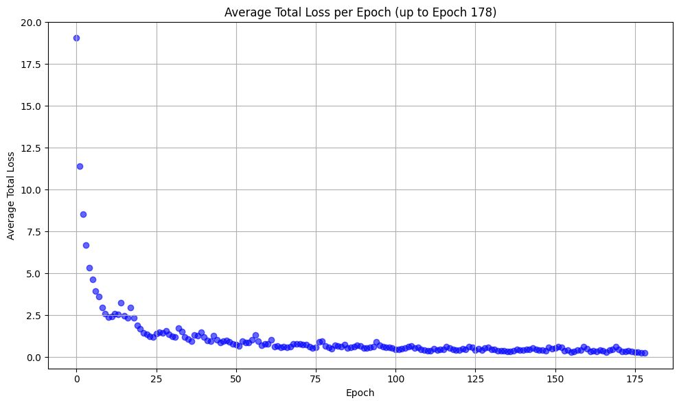

## Rezultate

Pentru fiecare celula din grila, modelul poate găsi o caseta. Poziția casetei este relativă la întreaga imagine - casetele identificate vor fi de obicei multe și foarte apropiate una de cealalta. După aplicarea NMS putem reține caseta finală. 

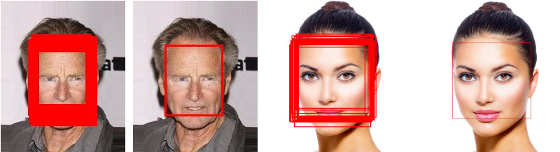

## Tranziția către YOLO v1. 

Modelul utilizat de noi este o versiune simplificată a arhitecturii YOLO v1 [Redmon et. al., 2015](https://arxiv.org/abs/1506.02640). Această arhitectură este făcută pentru detecția mai multor obiecte, nu doar a fețelor. Față de arhitectura noastră, YOLO v1 adaugă următoarele: 

- O arhitectură mai amplă a complexului convoluțional (24 strate)
- predicția a două casete de detecție pentru fiecare celulă a grilei
- coordonatele centrului casetelor de detecție sunt relative la coordonatele celulei grilei, nu ale întregii imagini
- extinderea capacității de învățare și predicție la 9 clase distincte (modelul nostru are o singură clasă). 